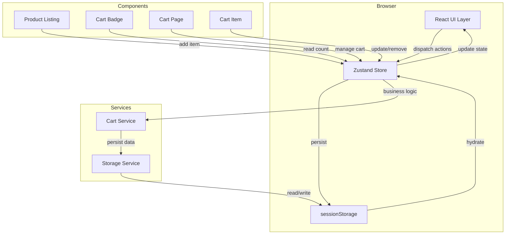
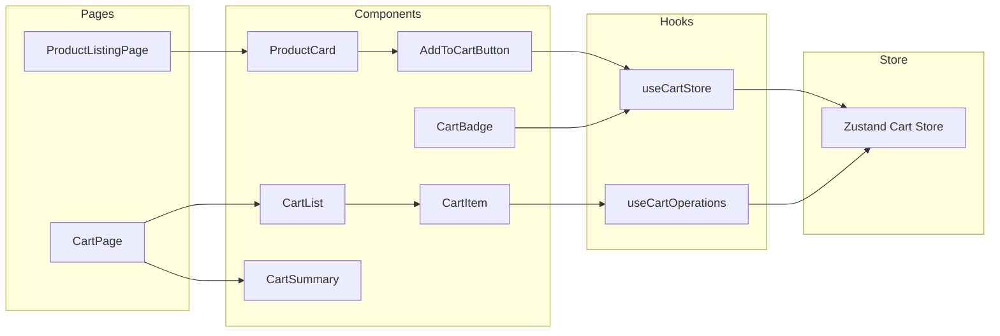
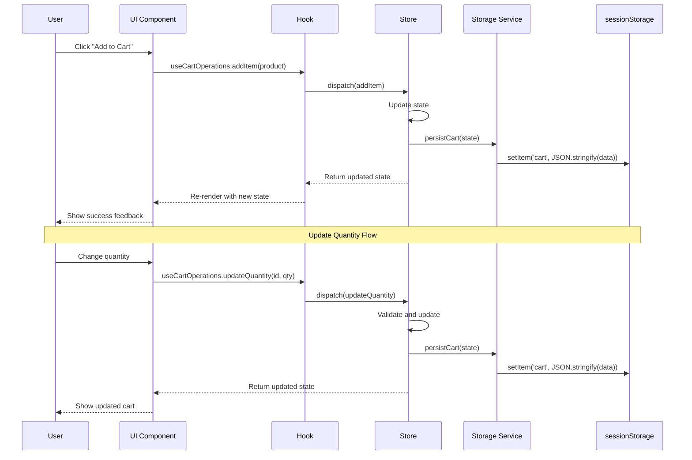
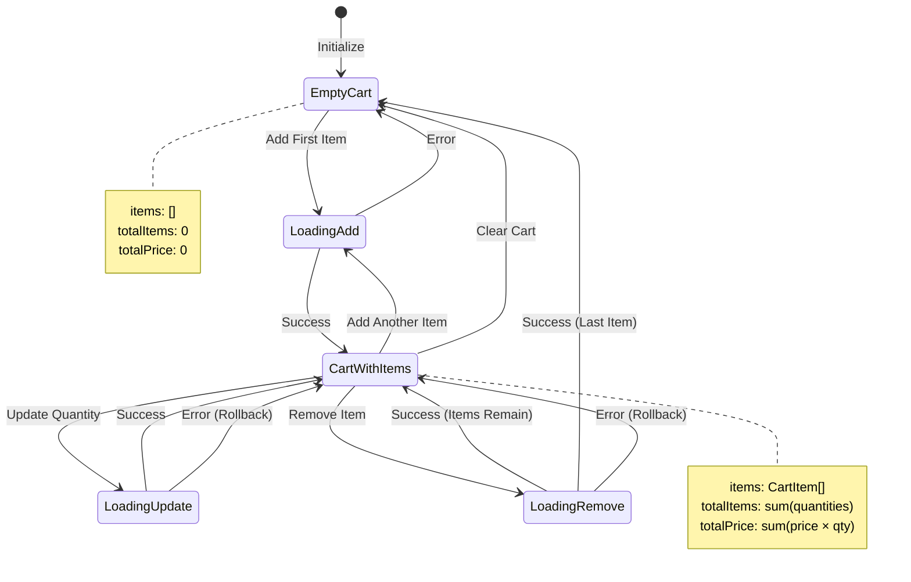

# Technical Design Document: Shopping Cart Management (EPMCDMETST-66906)

**Document Version:** 1.0  
**Last Updated:** 2024-01-20  
**Status:** Draft  
**Author:** Development Team  
**Jira Ticket:** [EPMCDMETST-66906](https://jira.example.com/browse/EPMCDMETST-66906)

---

## Table of Contents

1. [Overview](#1-overview)
2. [Explicit POC Scope](#2-explicit-poc-scope)
3. [Architecture](#3-architecture)
4. [Existing Repository Architecture](#4-existing-repository-architecture)
5. [Existing Implementation vs Planned Implementation](#5-existing-implementation-vs-planned-implementation)
6. [Component Hierarchy](#6-component-hierarchy)
7. [Component Interfaces](#7-component-interfaces)
8. [State / Data Flow](#8-state--data-flow)
9. [API Usage](#9-api-usage)
10. [localStorage / Storage Abstraction](#10-localstorage--storage-abstraction)
11. [Error Handling](#11-error-handling)
12. [Accessibility](#12-accessibility)
13. [Security](#13-security)
14. [Pagination](#14-pagination)
15. [Database / Data Model](#15-database--data-model)
16. [Testing Strategy](#16-testing-strategy)
17. [File / Module Changes](#17-file--module-changes)
18. [Deviations from plan.md](#18-deviations-from-planmd)
19. [Implementation Sequence](#19-implementation-sequence)
20. [Design Decisions & Assumptions](#20-design-decisions--assumptions)
21. [Requirement Traceability](#21-requirement-traceability)
22. [References](#22-references)
23. [As-Built Confirmation](#23-as-built-confirmation)
24. [Confluence Publication Readiness](#24-confluence-publication-readiness)

---

## 1. Overview

### 1.1 Purpose

This document provides the comprehensive technical design for implementing shopping cart management functionality in the existing React + TypeScript application. The implementation enables users to add medication products to a shopping cart, view cart contents, update quantities, and remove items.

### 1.2 Background

The current application displays medication products but lacks cart management capabilities. This POC implements a frontend-only shopping cart solution using sessionStorage for state persistence, without backend integration.

### 1.3 Goals

- Implement a fully functional shopping cart with add, view, update, and remove operations
- Provide persistent cart state using sessionStorage
- Ensure accessibility compliance (WCAG 2.1 AA)
- Maintain clean architecture with proper separation of concerns
- Achieve 80%+ code coverage with comprehensive testing

### 1.4 Technology Stack

- **Framework:** React 18.x
- **Language:** TypeScript 5.x
- **State Management:** Zustand 4.x
- **Styling:** CSS Modules / Styled Components
- **Testing:** Jest + React Testing Library
- **Storage:** sessionStorage (browser API)
- **Build Tool:** Vite / Webpack

---

## 2. Explicit POC Scope

### 2.1 In Scope

| Feature | Description | Priority |
|---------|-------------|----------|
| Add to Cart | Users can add medication products to cart from product listing | P0 |
| View Cart | Display cart contents with product details, quantities, and total | P0 |
| Update Quantity | Users can increase/decrease item quantities in cart | P0 |
| Remove Items | Users can remove individual items from cart | P0 |
| Cart Badge | Display item count in header/navigation | P0 |
| sessionStorage Persistence | Cart state persists across page refreshes within session | P0 |
| Error Handling | User-friendly error messages for cart operations | P1 |
| Accessibility | WCAG 2.1 AA compliance with keyboard navigation and screen readers | P1 |
| Unit & Integration Tests | Comprehensive test coverage (80%+) | P1 |

### 2.2 Out of Scope

| Feature | Rationale | Future Consideration |
|---------|-----------|---------------------|
| Backend Integration | POC is frontend-only | Phase 2 implementation |
| Checkout Process | Requires payment gateway integration | Post-POC |
| User Authentication | Not required for cart functionality | Phase 2 |
| Multi-currency Support | Single currency sufficient for POC | Phase 3 |
| Cart Sharing/Sync | Requires backend and user accounts | Phase 3 |
| Product Recommendations | ML/AI features out of scope | Future enhancement |
| Inventory Management | Stock validation requires backend | Phase 2 |
| Discount/Coupon Codes | Pricing logic requires backend | Phase 2 |
| Order History | Requires persistent storage and backend | Phase 2 |
| Guest Checkout | Checkout not in scope | Post-POC |

### 2.3 Simplifications

| Simplification | Justification | Impact |
|----------------|---------------|--------|
| No stock validation | Backend integration not available | Users may add unavailable items |
| sessionStorage only | No backend to sync data | Cart lost when session ends |
| Fixed pricing | No dynamic pricing/discounts | All users see same prices |
| No quantity limits | Product constraints unknown | Users can add unlimited quantities |
| Single currency (USD) | Simplifies pricing logic | Limited to US market |
| No cart expiration | POC doesn't require time constraints | Cart persists for entire session |

### 2.4 Limitations

| Limitation | Description | Mitigation |
|------------|-------------|-----------|
| Session-only persistence | Cart data lost when browser closes | Clear communication to users |
| No cross-device sync | Cart not accessible on other devices | Future backend implementation |
| Browser storage limits | sessionStorage typically 5-10MB | Monitor storage usage |
| No real-time updates | Changes not reflected across tabs | Single-tab assumption for POC |
| Client-side validation only | No server-side verification | Add backend validation in Phase 2 |
| Performance with large carts | Client-side processing for all operations | Implement pagination if needed |

---

## 3. Architecture

### 3.1 High-Level Architecture



### 3.2 Component Architecture



### 3.3 Data Flow Diagram



---

## 4. Existing Repository Architecture

### 4.1 Current Project Structure

```
src/
├── components/
│   ├── common/
│   │   ├── Button/
│   │   ├── Input/
│   │   └── Modal/
│   ├── product/
│   │   ├── ProductCard/
│   │   │   ├── ProductCard.tsx
│   │   │   ├── ProductCard.module.css
│   │   │   └── ProductCard.test.tsx
│   │   └── ProductList/
│   │       ├── ProductList.tsx
│   │       └── ProductList.test.tsx
│   └── layout/
│       ├── Header/
│       ├── Footer/
│       └── Navigation/
├── pages/
│   ├── HomePage.tsx
│   ├── ProductsPage.tsx
│   └── AboutPage.tsx
├── types/
│   ├── product.types.ts
│   └── common.types.ts
├── utils/
│   ├── formatters.ts
│   └── validators.ts
├── hooks/
│   └── useProducts.ts
├── App.tsx
└── main.tsx
```

### 4.2 Existing Technologies

| Technology | Version | Usage |
|------------|---------|-------|
| React | 18.2.0 | UI framework |
| TypeScript | 5.0.2 | Type safety |
| React Router | 6.8.0 | Navigation |
| Vite | 4.1.0 | Build tool |
| Jest | 29.4.0 | Testing |
| React Testing Library | 14.0.0 | Component testing |

### 4.3 Existing Product Type Definition

```typescript
// src/types/product.types.ts
export interface Product {
  id: string;
  name: string;
  description: string;
  price: number;
  imageUrl?: string;
  category: string;
  manufacturer?: string;
  dosage?: string;
  quantity?: number;
}
```

---

## 5. Existing Implementation vs Planned Implementation

### 5.1 Feature Comparison

| Feature | Current State | Planned Implementation | Impact |
|---------|---------------|------------------------|--------|
| Product Display | ✅ Implemented | No changes | None |
| Add to Cart | ❌ Not available | ✅ New feature | High |
| Cart State Management | ❌ Not available | ✅ Zustand store | High |
| Cart Persistence | ❌ Not available | ✅ sessionStorage | Medium |
| Cart UI | ❌ Not available | ✅ New components | High |
| Quantity Management | ❌ Not available | ✅ New feature | High |
| Cart Badge | ❌ Not available | ✅ New component | Medium |
| Error Handling | ⚠️ Basic | ✅ Enhanced | Medium |
| Accessibility | ⚠️ Partial | ✅ WCAG 2.1 AA | Medium |
| Testing | ✅ Products only | ✅ Cart coverage | High |

### 5.2 Component Changes

| Component | Current | Planned | Change Type |
|-----------|---------|---------|-------------|
| ProductCard | Display only | Add "Add to Cart" button | Modify |
| Header | Navigation only | Add CartBadge | Modify |
| Router | Basic routes | Add /cart route | Modify |
| N/A | N/A | CartPage | New |
| N/A | N/A | CartList | New |
| N/A | N/A | CartItem | New |
| N/A | N/A | CartSummary | New |
| N/A | N/A | AddToCartButton | New |

### 5.3 Type Definitions

| Type | Current | Planned | Change |
|------|---------|---------|--------|
| Product | Basic fields | No change | None |
| N/A | N/A | CartItem | New |
| N/A | N/A | Cart | New |
| N/A | N/A | CartStore | New |

---

## 6. Component Hierarchy

### 6.1 Component Tree

```
App
├── Router
│   ├── Layout
│   │   ├── Header
│   │   │   ├── Navigation
│   │   │   └── CartBadge (NEW)
│   │   └── Footer
│   ├── HomePage
│   ├── ProductsPage
│   │   └── ProductList
│   │       └── ProductCard (MODIFIED)
│   │           └── AddToCartButton (NEW)
│   └── CartPage (NEW)
│       ├── CartList (NEW)
│       │   └── CartItem (NEW)
│       │       ├── QuantitySelector (NEW)
│       │       └── RemoveButton (NEW)
│       └── CartSummary (NEW)
└── Providers
    └── CartStoreProvider (NEW)
```

### 6.2 Component Relationships

| Parent Component | Child Component | Relationship Type | Data Flow |
|------------------|-----------------|-------------------|-----------|
| App | CartStoreProvider | Context Provider | Store access |
| Header | CartBadge | Direct Child | Read cart count |
| ProductCard | AddToCartButton | Direct Child | Add item action |
| CartPage | CartList | Direct Child | Display items |
| CartPage | CartSummary | Direct Child | Display totals |
| CartList | CartItem | Mapped Children | Item management |
| CartItem | QuantitySelector | Direct Child | Update quantity |
| CartItem | RemoveButton | Direct Child | Remove item |

### 6.3 Component Responsibilities

| Component | Responsibility | State Management | Side Effects |
|-----------|----------------|------------------|--------------|
| CartBadge | Display cart item count | Read-only from store | None |
| AddToCartButton | Trigger add to cart action | None (calls hook) | Add item to store |
| CartPage | Layout for cart view | None (container) | None |
| CartList | Render list of cart items | None (presentational) | None |
| CartItem | Display single cart item with controls | None (calls hooks) | Update/remove item |
| QuantitySelector | UI for quantity adjustment | Local input state | Dispatch to store |
| RemoveButton | Trigger remove action | None | Remove from store |
| CartSummary | Calculate and display totals | Computed from store | None |

---

## 7. Component Interfaces

### 7.1 Type Definitions

```typescript
// src/types/cart.types.ts

/**
 * Represents a product item in the shopping cart
 */
export interface CartItem {
  /** Unique identifier for the product */
  id: string;
  /** Product name */
  name: string;
  /** Product price per unit */
  price: number;
  /** Quantity in cart (minimum 1) */
  quantity: number;
  /** Optional product image URL */
  imageUrl?: string;
  /** Product category */
  category: string;
  /** Optional manufacturer name */
  manufacturer?: string;
  /** Optional dosage information */
  dosage?: string;
}

/**
 * Shopping cart state structure
 */
export interface Cart {
  /** Array of items in the cart */
  items: CartItem[];
  /** Total number of items (sum of quantities) */
  totalItems: number;
  /** Total price of all items */
  totalPrice: number;
  /** Timestamp of last update */
  lastUpdated: Date;
}

/**
 * Result of cart operations with status
 */
export interface CartOperationResult {
  /** Whether operation succeeded */
  success: boolean;
  /** Error message if operation failed */
  error?: string;
  /** Updated cart state if successful */
  cart?: Cart;
}

/**
 * Options for adding items to cart
 */
export interface AddToCartOptions {
  /** Product to add */
  product: Product;
  /** Quantity to add (default: 1) */
  quantity?: number;
  /** Whether to show notification */
  showNotification?: boolean;
}

/**
 * Cart error types
 */
export enum CartErrorType {
  INVALID_QUANTITY = 'INVALID_QUANTITY',
  ITEM_NOT_FOUND = 'ITEM_NOT_FOUND',
  STORAGE_ERROR = 'STORAGE_ERROR',
  VALIDATION_ERROR = 'VALIDATION_ERROR',
}

/**
 * Cart error object
 */
export interface CartError {
  type: CartErrorType;
  message: string;
  itemId?: string;
}
```

### 7.2 Store Interface

```typescript
// src/store/cartStore.types.ts

import { Product } from '../types/product.types';
import { CartItem, Cart, CartError } from '../types/cart.types';

/**
 * Zustand cart store state and actions
 */
export interface CartStore {
  // State
  /** Current cart state */
  cart: Cart;
  /** Loading state for async operations */
  isLoading: boolean;
  /** Current error if any */
  error: CartError | null;
  
  // Actions
  /**
   * Add a product to the cart
   * @param product - Product to add
   * @param quantity - Quantity to add (default: 1)
   */
  addItem: (product: Product, quantity?: number) => void;
  
  /**
   * Remove an item from the cart
   * @param itemId - ID of item to remove
   */
  removeItem: (itemId: string) => void;
  
  /**
   * Update quantity of an item
   * @param itemId - ID of item to update
   * @param quantity - New quantity (must be >= 1)
   */
  updateQuantity: (itemId: string, quantity: number) => void;
  
  /**
   * Clear all items from cart
   */
  clearCart: () => void;
  
  /**
   * Get item by ID
   * @param itemId - ID of item to retrieve
   */
  getItem: (itemId: string) => CartItem | undefined;
  
  /**
   * Check if product is in cart
   * @param productId - ID of product to check
   */
  isInCart: (productId: string) => boolean;
  
  /**
   * Initialize cart from storage
   */
  initializeCart: () => void;
  
  /**
   * Clear any errors
   */
  clearError: () => void;
}
```

### 7.3 Component Props

```typescript
// src/components/cart/CartBadge/CartBadge.types.ts
export interface CartBadgeProps {
  /** Optional CSS class name */
  className?: string;
  /** Whether to show badge when count is 0 */
  showWhenEmpty?: boolean;
  /** Custom aria label */
  ariaLabel?: string;
}

// src/components/cart/AddToCartButton/AddToCartButton.types.ts
export interface AddToCartButtonProps {
  /** Product to add to cart */
  product: Product;
  /** Initial quantity to add */
  quantity?: number;
  /** Button variant style */
  variant?: 'primary' | 'secondary' | 'outline';
  /** Whether button is disabled */
  disabled?: boolean;
  /** Custom button text */
  children?: React.ReactNode;
  /** Callback after successful add */
  onSuccess?: () => void;
  /** Callback on error */
  onError?: (error: CartError) => void;
  /** Optional CSS class name */
  className?: string;
}

// src/components/cart/CartItem/CartItem.types.ts
export interface CartItemProps {
  /** Cart item to display */
  item: CartItem;
  /** Whether item is in loading state */
  isLoading?: boolean;
  /** Callback when quantity changes */
  onQuantityChange?: (itemId: string, quantity: number) => void;
  /** Callback when item is removed */
  onRemove?: (itemId: string) => void;
  /** Optional CSS class name */
  className?: string;
}

// src/components/cart/CartList/CartList.types.ts
export interface CartListProps {
  /** Array of cart items to display */
  items: CartItem[];
  /** Whether list is in loading state */
  isLoading?: boolean;
  /** Message to show when cart is empty */
  emptyMessage?: string;
  /** Optional CSS class name */
  className?: string;
}

// src/components/cart/CartSummary/CartSummary.types.ts
export interface CartSummaryProps {
  /** Cart object with totals */
  cart: Cart;
  /** Whether to show checkout button */
  showCheckoutButton?: boolean;
  /** Callback when checkout is clicked */
  onCheckout?: () => void;
  /** Optional CSS class name */
  className?: string;
}

// src/components/cart/QuantitySelector/QuantitySelector.types.ts
export interface QuantitySelectorProps {
  /** Current quantity value */
  value: number;
  /** Minimum allowed quantity */
  min?: number;
  /** Maximum allowed quantity */
  max?: number;
  /** Callback when quantity changes */
  onChange: (quantity: number) => void;
  /** Whether selector is disabled */
  disabled?: boolean;
  /** Optional CSS class name */
  className?: string;
  /** Aria label for accessibility */
  ariaLabel?: string;
}
```

### 7.4 Hook Interfaces

```typescript
// src/hooks/useCartOperations.types.ts
export interface UseCartOperationsReturn {
  /** Add item to cart */
  addItem: (product: Product, quantity?: number) => Promise<CartOperationResult>;
  /** Remove item from cart */
  removeItem: (itemId: string) => Promise<CartOperationResult>;
  /** Update item quantity */
  updateQuantity: (itemId: string, quantity: number) => Promise<CartOperationResult>;
  /** Clear entire cart */
  clearCart: () => Promise<CartOperationResult>;
  /** Whether any operation is in progress */
  isLoading: boolean;
  /** Current error if any */
  error: CartError | null;
}

// src/hooks/useCart.types.ts
export interface UseCartReturn {
  /** Current cart state */
  cart: Cart;
  /** Cart items array */
  items: CartItem[];
  /** Total item count */
  totalItems: number;
  /** Total price */
  totalPrice: number;
  /** Check if product is in cart */
  isInCart: (productId: string) => boolean;
  /** Get specific cart item */
  getItem: (itemId: string) => CartItem | undefined;
  /** Whether cart is empty */
  isEmpty: boolean;
}
```

---

## 8. State / Data Flow

### 8.1 Complete User Flow: Add Product to Cart

**Step-by-Step State Updates:**

1. **Initial State:**
```typescript
{
  cart: {
    items: [],
    totalItems: 0,
    totalPrice: 0,
    lastUpdated: null
  },
  isLoading: false,
  error: null
}
```

2. **User clicks "Add to Cart" on ProductCard:**
   - UI Component: `AddToCartButton` onClick triggered
   - Hook called: `useCartOperations().addItem(product, quantity)`

3. **Hook validates input:**
```typescript
// Validation
if (!product || !product.id) {
  return { success: false, error: 'Invalid product' };
}
if (quantity < 1) {
  return { success: false, error: 'Quantity must be at least 1' };
}
```

4. **Store action dispatched:**
```typescript
// Store sets loading state
{
  cart: { /* unchanged */ },
  isLoading: true,
  error: null
}
```

5. **Store updates cart state:**
```typescript
// Check if item already exists
const existingItem = state.cart.items.find(item => item.id === product.id);

if (existingItem) {
  // Update quantity of existing item
  const updatedItems = state.cart.items.map(item =>
    item.id === product.id
      ? { ...item, quantity: item.quantity + quantity }
      : item
  );
  
  // New state
  {
    cart: {
      items: updatedItems,
      totalItems: calculateTotalItems(updatedItems),
      totalPrice: calculateTotalPrice(updatedItems),
      lastUpdated: new Date()
    },
    isLoading: false,
    error: null
  }
} else {
  // Add new item
  const newItem: CartItem = {
    id: product.id,
    name: product.name,
    price: product.price,
    quantity: quantity,
    imageUrl: product.imageUrl,
    category: product.category,
    manufacturer: product.manufacturer,
    dosage: product.dosage
  };
  
  // New state
  {
    cart: {
      items: [...state.cart.items, newItem],
      totalItems: state.cart.totalItems + quantity,
      totalPrice: state.cart.totalPrice + (product.price * quantity),
      lastUpdated: new Date()
    },
    isLoading: false,
    error: null
  }
}
```

6. **State persisted to sessionStorage:**
```typescript
// Storage service called
sessionStorage.setItem('shopping-cart', JSON.stringify({
  items: state.cart.items,
  totalItems: state.cart.totalItems,
  totalPrice: state.cart.totalPrice,
  lastUpdated: state.cart.lastUpdated.toISOString()
}));
```

7. **UI Components re-render with new state:**
   - `CartBadge` updates to show new item count
   - `AddToCartButton` shows success feedback
   - Product card may show "In Cart" indicator

### 8.2 Update Quantity Flow

**Initial State (with existing cart):**
```typescript
{
  cart: {
    items: [
      { id: '1', name: 'Aspirin', price: 9.99, quantity: 2, ... }
    ],
    totalItems: 2,
    totalPrice: 19.98,
    lastUpdated: '2024-01-20T10:00:00Z'
  },
  isLoading: false,
  error: null
}
```

**User changes quantity from 2 to 3:**

1. `QuantitySelector` onChange triggered with new value (3)
2. `CartItem` calls `onQuantityChange(itemId, 3)`
3. Hook `useCartOperations().updateQuantity('1', 3)` called
4. Store validates: `quantity >= 1` ✓
5. Store updates state:
```typescript
{
  cart: {
    items: [
      { id: '1', name: 'Aspirin', price: 9.99, quantity: 3, ... }
    ],
    totalItems: 3,
    totalPrice: 29.97,
    lastUpdated: '2024-01-20T10:05:00Z'
  },
  isLoading: false,
  error: null
}
```
6. State persisted to sessionStorage
7. `CartItem` and `CartSummary` re-render with updated values

### 8.3 Remove Item Flow

**User clicks "Remove" button:**

1. `RemoveButton` onClick triggered
2. `CartItem` calls `onRemove(itemId)`
3. Hook `useCartOperations().removeItem('1')` called
4. Store filters out item:
```typescript
{
  cart: {
    items: [],
    totalItems: 0,
    totalPrice: 0,
    lastUpdated: '2024-01-20T10:10:00Z'
  },
  isLoading: false,
  error: null
}
```
5. State persisted to sessionStorage
6. `CartList` re-renders showing empty state
7. `CartBadge` updates to show 0 items

### 8.4 State Flow Diagram



---

## 9. API Usage

### 9.1 Not Applicable

This POC implementation is **frontend-only** and does not include backend API integration.

### 9.2 Future API Considerations

When backend integration is implemented in Phase 2, the following API endpoints will be required:

| Endpoint | Method | Purpose | Request Body | Response |
|----------|--------|---------|--------------|----------|
| `/api/cart` | GET | Retrieve user's cart | N/A | `Cart` object |
| `/api/cart/items` | POST | Add item to cart | `{ productId, quantity }` | Updated `Cart` |
| `/api/cart/items/:id` | PUT | Update item quantity | `{ quantity }` | Updated `Cart` |
| `/api/cart/items/:id` | DELETE | Remove item | N/A | Updated `Cart` |
| `/api/cart` | DELETE | Clear entire cart | N/A | Empty `Cart` |
| `/api/cart/sync` | POST | Sync local cart with server | `Cart` object | Merged `Cart` |

### 9.3 Migration Strategy

When transitioning to backend APIs:

1. **Create API service layer:**
```typescript
// src/services/api/cartApi.ts (future implementation)
export class CartApiService {
  async getCart(): Promise<Cart> { /* ... */ }
  async addItem(productId: string, quantity: number): Promise<Cart> { /* ... */ }
  async updateItem(itemId: string, quantity: number): Promise<Cart> { /* ... */ }
  async removeItem(itemId: string): Promise<Cart> { /* ... */ }
  async clearCart(): Promise<void> { /* ... */ }
}
```

2. **Update store to use API instead of sessionStorage**
3. **Implement optimistic updates with rollback**
4. **Add authentication headers**
5. **Handle network errors and retries**

---

## 10. localStorage / Storage Abstraction

### 10.1 Storage Strategy

This implementation uses **sessionStorage** instead of localStorage for the following reasons:

| Reason | Justification |
|--------|---------------|
| Session-scoped | Cart should be temporary until session ends |
| Security | Reduces risk of stale data persisting indefinitely |
| Privacy | Cart contents don't persist across browser sessions |
| Simplicity | No need for expiration logic or cleanup |

### 10.2 Storage Service Implementation

```typescript
// src/services/storage/storageService.ts

import { Cart, CartItem } from '../../types/cart.types';

/**
 * Storage key for cart data
 */
const CART_STORAGE_KEY = 'shopping-cart';

/**
 * Serialized cart data structure
 */
interface SerializedCart {
  items: CartItem[];
  totalItems: number;
  totalPrice: number;
  lastUpdated: string; // ISO string
}

/**
 * Storage service for cart persistence
 */
export class StorageService {
  /**
   * Save cart to sessionStorage
   */
  static saveCart(cart: Cart): void {
    try {
      const serialized: SerializedCart = {
        items: cart.items,
        totalItems: cart.totalItems,
        totalPrice: cart.totalPrice,
        lastUpdated: cart.lastUpdated.toISOString(),
      };
      
      sessionStorage.setItem(CART_STORAGE_KEY, JSON.stringify(serialized));
    } catch (error) {
      console.error('Failed to save cart to storage:', error);
      throw new Error('Storage operation failed');
    }
  }

  /**
   * Load cart from sessionStorage
   */
  static loadCart(): Cart | null {
    try {
      const data = sessionStorage.getItem(CART_STORAGE_KEY);
      
      if (!data) {
        return null;
      }
      
      const parsed: SerializedCart = JSON.parse(data);
      
      // Validate data structure
      if (!this.isValidCartData(parsed)) {
        console.warn('Invalid cart data in storage, clearing...');
        this.clearCart();
        return null;
      }
      
      return {
        items: parsed.items,
        totalItems: parsed.totalItems,
        totalPrice: parsed.totalPrice,
        lastUpdated: new Date(parsed.lastUpdated),
      };
    } catch (error) {
      console.error('Failed to load cart from storage:', error);
      return null;
    }
  }

  /**
   * Clear cart from sessionStorage
   */
  static clearCart(): void {
    try {
      sessionStorage.removeItem(CART_STORAGE_KEY);
    } catch (error) {
      console.error('Failed to clear cart from storage:', error);
    }
  }

  /**
   * Check if storage is available
   */
  static isStorageAvailable(): boolean {
    try {
      const testKey = '__storage_test__';
      sessionStorage.setItem(testKey, 'test');
      sessionStorage.removeItem(testKey);
      return true;
    } catch (error) {
      return false;
    }
  }

  /**
   * Get storage usage information
   */
  static getStorageInfo(): { used: number; available: boolean } {
    const available = this.isStorageAvailable();
    let used = 0;
    
    if (available) {
      try {
        const data = sessionStorage.getItem(CART_STORAGE_KEY);
        used = data ? new Blob([data]).size : 0;
      } catch (error) {
        console.error('Failed to get storage info:', error);
      }
    }
    
    return { used, available };
  }

  /**
   * Validate cart data structure
   */
  private static isValidCartData(data: any): data is SerializedCart {
    return (
      data &&
      typeof data === 'object' &&
      Array.isArray(data.items) &&
      typeof data.totalItems === 'number' &&
      typeof data.totalPrice === 'number' &&
      typeof data.lastUpdated === 'string'
    );
  }
}
```

### 10.3 Storage Integration with Store

```typescript
// src/store/cartStore.ts (relevant portions)

import { create } from 'zustand';
import { CartStore } from './cartStore.types';
import { StorageService } from '../services/storage/storageService';

export const useCartStore = create<CartStore>((set, get) => ({
  // Initialize with data from storage
  cart: StorageService.loadCart() || {
    items: [],
    totalItems: 0,
    totalPrice: 0,
    lastUpdated: new Date(),
  },
  
  isLoading: false,
  error: null,
  
  addItem: (product, quantity = 1) => {
    // ... add logic ...
    
    // Persist after update
    const state = get();
    StorageService.saveCart(state.cart);
  },
  
  updateQuantity: (itemId, quantity) => {
    // ... update logic ...
    
    // Persist after update
    const state = get();
    StorageService.saveCart(state.cart);
  },
  
  removeItem: (itemId) => {
    // ... remove logic ...
    
    // Persist after update
    const state = get();
    StorageService.saveCart(state.cart);
  },
  
  clearCart: () => {
    set({
      cart: {
        items: [],
        totalItems: 0,
        totalPrice: 0,
        lastUpdated: new Date(),
      },
      error: null,
    });
    
    StorageService.clearCart();
  },
  
  initializeCart: () => {
    const savedCart = StorageService.loadCart();
    if (savedCart) {
      set({ cart: savedCart });
    }
  },
}));
```

### 10.4 Storage Error Handling

```typescript
// src/utils/storageErrorHandler.ts

export class StorageError extends Error {
  constructor(message: string, public originalError?: Error) {
    super(message);
    this.name = 'StorageError';
  }
}

export function handleStorageError(error: Error): void {
  if (error.name === 'QuotaExceededError') {
    // Storage quota exceeded
    console.error('Storage quota exceeded. Clearing old data...');
    StorageService.clearCart();
  } else if (error.name === 'SecurityError') {
    // Storage access denied (e.g., in private browsing)
    console.error('Storage access denied. Cart will not persist.');
  } else {
    console.error('Storage operation failed:', error);
  }
}
```

---

## 11. Error Handling

### 11.1 Error Categories

| Category | Description | User Impact | Recovery Strategy |
|----------|-------------|-------------|-------------------|
| Validation Errors | Invalid input (quantity < 1, missing product ID) | Operation blocked | Show validation message |
| Storage Errors | sessionStorage unavailable or quota exceeded | Cart not persisted | In-memory only mode |
| Item Not Found | Attempting to update/remove non-existent item | Operation fails | Refresh cart state |
| State Errors | Store state corruption | Inconsistent UI | Reset to empty cart |
| Network Errors | (Future) API calls fail | Operation fails | Retry with exponential backoff |

### 11.2 Error Type Definitions

```typescript
// src/types/errors.ts

export enum ErrorSeverity {
  INFO = 'info',
  WARNING = 'warning',
  ERROR = 'error',
  CRITICAL = 'critical',
}

export interface AppError {
  code: string;
  message: string;
  severity: ErrorSeverity;
  timestamp: Date;
  details?: Record<string, any>;
  stack?: string;
}

export class CartValidationError extends Error {
  code = 'CART_VALIDATION_ERROR';
  severity = ErrorSeverity.WARNING;
  
  constructor(message: string, public field?: string) {
    super(message);
    this.name = 'CartValidationError';
  }
}

export class StorageOperationError extends Error {
  code = 'STORAGE_OPERATION_ERROR';
  severity = ErrorSeverity.ERROR;
  
  constructor(message: string, public operation: string) {
    super(message);
    this.name = 'StorageOperationError';
  }
}

export class ItemNotFoundError extends Error {
  code = 'ITEM_NOT_FOUND';
  severity = ErrorSeverity.WARNING;
  
  constructor(public itemId: string) {
    super(`Item with ID ${itemId} not found in cart`);
    this.name = 'ItemNotFoundError';
  }
}
```

### 11.3 Error Handling Implementation

```typescript
// src/utils/errorHandler.ts

import { AppError, ErrorSeverity } from '../types/errors';

/**
 * Global error handler
 */
export class ErrorHandler {
  /**
   * Handle and log error
   */
  static handle(error: Error): AppError {
    const appError: AppError = {
      code: this.getErrorCode(error),
      message: error.message,
      severity: this.getErrorSeverity(error),
      timestamp: new Date(),
      details: this.getErrorDetails(error),
      stack: process.env.NODE_ENV === 'development' ? error.stack : undefined,
    };
    
    // Log error
    this.logError(appError);
    
    // Send to monitoring service (future)
    // this.sendToMonitoring(appError);
    
    return appError;
  }
  
  /**
   * Get user-friendly error message
   */
  static getUserMessage(error: Error): string {
    const errorMessages: Record<string, string> = {
      CART_VALIDATION_ERROR: 'Please check your input and try again.',
      STORAGE_OPERATION_ERROR: 'Unable to save cart. Your changes may not persist.',
      ITEM_NOT_FOUND: 'The item you\'re looking for is no longer in your cart.',
      QUOTA_EXCEEDED: 'Storage limit reached. Please remove some items.',
      UNKNOWN_ERROR: 'Something went wrong. Please try again.',
    };
    
    const code = this.getErrorCode(error);
    return errorMessages[code] || errorMessages.UNKNOWN_ERROR;
  }
  
  private static getErrorCode(error: Error): string {
    if ('code' in error) {
      return (error as any).code;
    }
    if (error.name === 'QuotaExceededError') {
      return 'QUOTA_EXCEEDED';
    }
    return 'UNKNOWN_ERROR';
  }
  
  private static getErrorSeverity(error: Error): ErrorSeverity {
    if ('severity' in error) {
      return (error as any).severity;
    }
    return ErrorSeverity.ERROR;
  }
  
  private static getErrorDetails(error: Error): Record<string, any> {
    const details: Record<string, any> = {
      name: error.name,
    };
    
    // Extract custom properties
    Object.keys(error).forEach(key => {
      if (key !== 'message' && key !== 'name' && key !== 'stack') {
        details[key] = (error as any)[key];
      }
    });
    
    return details;
  }
  
  private static logError(error: AppError): void {
    const logLevel = this.getLogLevel(error.severity);
    const logMessage = `[${error.code}] ${error.message}`;
    
    switch (logLevel) {
      case 'error':
        console.error(logMessage, error);
        break;
      case 'warn':
        console.warn(logMessage, error);
        break;
      default:
        console.log(logMessage, error);
    }
  }
  
  private static getLogLevel(severity: ErrorSeverity): 'log' | 'warn' | 'error' {
    switch (severity) {
      case ErrorSeverity.CRITICAL:
      case ErrorSeverity.ERROR:
        return 'error';
      case ErrorSeverity.WARNING:
        return 'warn';
      default:
        return 'log';
    }
  }
}
```

### 11.4 Store Error Handling

```typescript
// src/store/cartStore.ts (error handling portions)

export const useCartStore = create<CartStore>((set, get) => ({
  // ... other state ...
  
  addItem: (product, quantity = 1) => {
    try {
      // Validation
      if (!product?.id) {
        throw new CartValidationError('Invalid product', 'product');
      }
      if (quantity < 1) {
        throw new CartValidationError('Quantity must be at least 1', 'quantity');
      }
      
      set({ isLoading: true, error: null });
      
      // ... add item logic ...
      
      // Persist
      try {
        StorageService.saveCart(get().cart);
      } catch (storageError) {
        // Non-fatal: continue with in-memory cart
        console.warn('Failed to persist cart:', storageError);
      }
      
      set({ isLoading: false });
    } catch (error) {
      const appError = ErrorHandler.handle(error as Error);
      set({
        isLoading: false,
        error: {
          type: CartErrorType.VALIDATION_ERROR,
          message: ErrorHandler.getUserMessage(error as Error),
        },
      });
    }
  },
  
  updateQuantity: (itemId, quantity) => {
    try {
      if (quantity < 1) {
        throw new CartValidationError('Quantity must be at least 1', 'quantity');
      }
      
      const item = get().cart.items.find(i => i.id === itemId);
      if (!item) {
        throw new ItemNotFoundError(itemId);
      }
      
      set({ isLoading: true, error: null });
      
      // ... update logic ...
      
      StorageService.saveCart(get().cart);
      set({ isLoading: false });
    } catch (error) {
      ErrorHandler.handle(error as Error);
      set({
        isLoading: false,
        error: {
          type: CartErrorType.ITEM_NOT_FOUND,
          message: ErrorHandler.getUserMessage(error as Error),
          itemId,
        },
      });
    }
  },
  
  clearError: () => {
    set({ error: null });
  },
}));
```

### 11.5 Component Error Handling

```typescript
// src/components/cart/AddToCartButton/AddToCartButton.tsx

export const AddToCartButton: React.FC<AddToCartButtonProps> = ({
  product,
  quantity = 1,
  onSuccess,
  onError,
  ...props
}) => {
  const { addItem, error } = useCartStore();
  const [showSuccess, setShowSuccess] = useState(false);
  
  const handleClick = async () => {
    try {
      addItem(product, quantity);
      
      if (!error) {
        setShowSuccess(true);
        setTimeout(() => setShowSuccess(false), 2000);
        onSuccess?.();
      } else {
        onError?.(error);
      }
    } catch (err) {
      const appError = ErrorHandler.handle(err as Error);
      onError?.(error);
    }
  };
  
  return (
    <>
      <button onClick={handleClick} {...props}>
        Add to Cart
      </button>
      {showSuccess && <SuccessMessage>Added to cart!</SuccessMessage>}
      {error && <ErrorMessage>{error.message}</ErrorMessage>}
    </>
  );
};
```

---

## 12. Accessibility

### 12.1 WCAG 2.1 AA Compliance Requirements

| WCAG Criterion | Level | Requirement | Implementation |
|----------------|-------|-------------|----------------|
| 1.1.1 Non-text Content | A | Alt text for images | Product images have descriptive alt text |
| 1.3.1 Info and Relationships | A | Semantic HTML | Proper heading hierarchy, lists, buttons |
| 1.4.3 Contrast | AA | 4.5:1 minimum | All text meets contrast ratio |
| 2.1.1 Keyboard | A | All functionality keyboard accessible | Tab navigation, Enter/Space activation |
| 2.1.2 No Keyboard Trap | A | Focus can move away | Proper focus management |
| 2.4.3 Focus Order | A | Logical focus sequence | Tab order follows visual layout |
| 2.4.7 Focus Visible | AA | Visible focus indicator | Custom focus styles |
| 3.2.1 On Focus | A | No context change on focus | Focus doesn't trigger actions |
| 3.2.2 On Input | A | No context change on input | Input changes don't cause surprises |
| 4.1.2 Name, Role, Value | A | ARIA labels | All interactive elements labeled |
| 4.1.3 Status Messages | AA | Live regions for updates | Cart updates announced |

### 12.2 Keyboard Navigation

```typescript
// src/components/cart/CartItem/CartItem.tsx

export const CartItem: React.FC<CartItemProps> = ({ item, onQuantityChange, onRemove }) => {
  const quantityInputRef = useRef<HTMLInputElement>(null);
  
  /**
   * Handle keyboard navigation for quantity controls
   */
  const handleQuantityKeyDown = (e: React.KeyboardEvent) => {
    switch (e.key) {
      case 'ArrowUp':
        e.preventDefault();
        onQuantityChange?.(item.id, item.quantity + 1);
        break;
      case 'ArrowDown':
        e.preventDefault();
        if (item.quantity > 1) {
          onQuantityChange?.(item.id, item.quantity - 1);
        }
        break;
      case 'Home':
        e.preventDefault();
        onQuantityChange?.(item.id, 1);
        break;
      case 'End':
        e.preventDefault();
        onQuantityChange?.(item.id, 99);
        break;
    }
  };
  
  return (
    <article 
      className="cart-item"
      role="article"
      aria-labelledby={`item-name-${item.id}`}
    >
      
      
      <div className="item-details">
        <h3 id={`item-name-${item.id}`}>{item.name}</h3>
        <p className="item-price" aria-label={`Price: $${item.price}`}>
          ${item.price.toFixed(2)}
        </p>
      </div>
      
      <div className="item-controls">
        <label htmlFor={`quantity-${item.id}`} className="visually-hidden">
          Quantity for {item.name}
        </label>
        
        <div className="quantity-selector" role="group" aria-label="Quantity controls">
          <button
            type="button"
            onClick={() => onQuantityChange?.(item.id, item.quantity - 1)}
            disabled={item.quantity <= 1}
            aria-label="Decrease quantity"
            className="quantity-btn"
          >
            <MinusIcon aria-hidden="true" />
          </button>
          
          <input
            ref={quantityInputRef}
            id={`quantity-${item.id}`}
            type="number"
            min="1"
            max="99"
            value={item.quantity}
            onChange={(e) => onQuantityChange?.(item.id, parseInt(e.target.value, 10))}
            onKeyDown={handleQuantityKeyDown}
            aria-label={`Quantity: ${item.quantity}`}
            aria-valuemin={1}
            aria-valuemax={99}
            aria-valuenow={item.quantity}
          />
          
          <button
            type="button"
            onClick={() => onQuantityChange?.(item.id, item.quantity + 1)}
            disabled={item.quantity >= 99}
            aria-label="Increase quantity"
            className="quantity-btn"
          >
            <PlusIcon aria-hidden="true" />
          </button>
        </div>
        
        <button
          type="button"
          onClick={() => onRemove?.(item.id)}
          aria-label={`Remove ${item.name} from cart`}
          className="remove-btn"
        >
          <TrashIcon aria-hidden="true" />
          <span className="visually-hidden">Remove</span>
        </button>
      </div>
    </article>
  );
};
```

### 12.3 ARIA Labels and Roles

```typescript
// src/components/cart/CartBadge/CartBadge.tsx

export const CartBadge: React.FC<CartBadgeProps> = ({ 
  ariaLabel = 'Shopping cart',
  showWhenEmpty = false 
}) => {
  const { totalItems } = useCart();
  
  if (!showWhenEmpty && totalItems === 0) {
    return null;
  }
  
  return (
    <Link 
      to="/cart"
      className="cart-badge-link"
      aria-label={`${ariaLabel}, ${totalItems} ${totalItems === 1 ? 'item' : 'items'}`}
    >
      <CartIcon aria-hidden="true" />
      
      {totalItems > 0 && (
        <span 
          className="badge-count"
          aria-label={`${totalItems} items`}
          role="status"
        >
          {totalItems > 99 ? '99+' : totalItems}
        </span>
      )}
    </Link>
  );
};
```

```typescript
// src/components/cart/CartPage/CartPage.tsx

export const CartPage: React.FC = () => {
  const { cart, isEmpty } = useCart();
  const [announceMessage, setAnnounceMessage] = useState('');
  
  useEffect(() => {
    // Announce cart status to screen readers
    if (isEmpty) {
      setAnnounceMessage('Your shopping cart is empty');
    } else {
      setAnnounceMessage(`Shopping cart contains ${cart.totalItems} items`);
    }
  }, [isEmpty, cart.totalItems]);
  
  return (
    <main 
      className="cart-page"
      role="main"
      aria-labelledby="cart-heading"
    >
      {/* Live region for screen reader announcements */}
      <div 
        role="status" 
        aria-live="polite" 
        aria-atomic="true"
        className="visually-hidden"
      >
        {announceMessage}
      </div>
      
      <h1 id="cart-heading">Shopping Cart</h1>
      
      {isEmpty ? (
        <EmptyCartMessage />
      ) : (
        <>
          <CartList items={cart.items} />
          <CartSummary cart={cart} />
        </>
      )}
    </main>
  );
};
```

### 12.4 Focus Management

```typescript
// src/hooks/useFocusManagement.ts

import { useEffect, useRef } from 'react';

/**
 * Hook for managing focus after dynamic content changes
 */
export function useFocusManagement() {
  const previousFocusRef = useRef<HTMLElement | null>(null);
  
  /**
   * Save current focus before operation
   */
  const saveFocus = () => {
    previousFocusRef.current = document.activeElement as HTMLElement;
  };
  
  /**
   * Restore focus to previously focused element
   */
  const restoreFocus = () => {
    if (previousFocusRef.current && document.contains(previousFocusRef.current)) {
      previousFocusRef.current.focus();
    }
  };
  
  /**
   * Move focus to specific element
   */
  const moveFocusTo = (selector: string) => {
    const element = document.querySelector<HTMLElement>(selector);
    if (element) {
      element.focus();
    }
  };
  
  /**
   * Trap focus within container (for modals, etc.)
   */
  const trapFocus = (containerRef: React.RefObject<HTMLElement>) => {
    const container = containerRef.current;
    if (!container) return;
    
    const focusableElements = container.querySelectorAll<HTMLElement>(
      'button, [href], input, select, textarea, [tabindex]:not([tabindex="-1"])'
    );
    
    const firstElement = focusableElements[0];
    const lastElement = focusableElements[focusableElements.length - 1];
    
    const handleKeyDown = (e: KeyboardEvent) => {
      if (e.key !== 'Tab') return;
      
      if (e.shiftKey) {
        if (document.activeElement === firstElement) {
          e.preventDefault();
          lastElement.focus();
        }
      } else {
        if (document.activeElement === lastElement) {
          e.preventDefault();
          firstElement.focus();
        }
      }
    };
    
    container.addEventListener('keydown', handleKeyDown);
    firstElement?.focus();
    
    return () => {
      container.removeEventListener('keydown', handleKeyDown);
    };
  };
  
  return {
    saveFocus,
    restoreFocus,
    moveFocusTo,
    trapFocus,
  };
}
```

### 12.5 CSS for Accessibility

```css
/* src/styles/accessibility.css */

/* Visually hidden but accessible to screen readers */
.visually-hidden {
  position: absolute;
  width: 1px;
  height: 1px;
  padding: 0;
  margin: -1px;
  overflow: hidden;
  clip: rect(0, 0, 0, 0);
  white-space: nowrap;
  border: 0;
}

/* Focus visible styles */
:focus-visible {
  outline: 3px solid var(--color-focus);
  outline-offset: 2px;
}

/* Remove outline for mouse users */
:focus:not(:focus-visible) {
  outline: none;
}

/* High contrast focus for buttons */
button:focus-visible,
a:focus-visible {
  outline: 3px solid var(--color-focus);
  outline-offset: 2px;
  box-shadow: 0 0 0 4px var(--color-focus-shadow);
}

/* Skip to main content link */
.skip-to-main {
  position: absolute;
  top: -40px;
  left: 0;
  background: var(--color-primary);
  color: white;
  padding: 8px 16px;
  text-decoration: none;
  z-index: 1000;
}

.skip-to-main:focus {
  top: 0;
}

/* Ensure sufficient color contrast */
:root {
  --color-text: #212121;
  --color-background: #ffffff;
  --color-focus: #005fcc;
  --color-focus-shadow: rgba(0, 95, 204, 0.25);
  --color-error: #d32f2f;
  --color-success: #388e3c;
}

/* Reduced motion support */
@media (prefers-reduced-motion: reduce) {
  *,
  *::before,
  *::after {
    animation-duration: 0.01ms !important;
    animation-iteration-count: 1 !important;
    transition-duration: 0.01ms !important;
  }
}
```

---

## 13. Security

### 13.1 Input Validation

```typescript
// src/utils/validation.ts

/**
 * Validation utilities for cart operations
 */
export class CartValidator {
  /**
   * Validate product ID
   */
  static validateProductId(id: any): boolean {
    if (typeof id !== 'string') return false;
    if (id.trim().length === 0) return false;
    // Check for valid UUID format or alphanumeric
    return /^[a-zA-Z0-9-_]+$/.test(id);
  }
  
  /**
   * Validate quantity
   */
  static validateQuantity(quantity: any): { valid: boolean; error?: string } {
    if (typeof quantity !== 'number') {
      return { valid: false, error: 'Quantity must be a number' };
    }
    
    if (!Number.isInteger(quantity)) {
      return { valid: false, error: 'Quantity must be a whole number' };
    }
    
    if (quantity < 1) {
      return { valid: false, error: 'Quantity must be at least 1' };
    }
    
    if (quantity > 999) {
      return { valid: false, error: 'Quantity cannot exceed 999' };
    }
    
    return { valid: true };
  }
  
  /**
   * Validate price
   */
  static validatePrice(price: any): boolean {
    if (typeof price !== 'number') return false;
    if (price < 0) return false;
    if (!Number.isFinite(price)) return false;
    return true;
  }
  
  /**
   * Sanitize product name
   */
  static sanitizeProductName(name: string): string {
    if (typeof name !== 'string') return '';
    
    // Remove HTML tags
    let sanitized = name.replace(/<[^>]*>/g, '');
    
    // Remove script content
    sanitized = sanitized.replace(/<script\b[^<]*(?:(?!<\/script>)<[^<]*)*<\/script>/gi, '');
    
    // Trim and limit length
    sanitized = sanitized.trim().substring(0, 200);
    
    return sanitized;
  }
  
  /**
   * Validate product object
   */
  static validateProduct(product: any): { valid: boolean; errors: string[] } {
    const errors: string[] = [];
    
    if (!product) {
      errors.push('Product is required');
      return { valid: false, errors };
    }
    
    if (!this.validateProductId(product.id)) {
      errors.push('Invalid product ID');
    }
    
    if (!product.name || typeof product.name !== 'string' || product.name.trim().length === 0) {
      errors.push('Product name is required');
    }
    
    if (!this.validatePrice(product.price)) {
      errors.push('Invalid product price');
    }
    
    return {
      valid: errors.length === 0,
      errors,
    };
  }
}
```

### 13.2 XSS Prevention

```typescript
// src/utils/sanitization.ts

/**
 * Sanitization utilities to prevent XSS attacks
 */
export class Sanitizer {
  /**
   * Escape HTML special characters
   */
  static escapeHtml(text: string): string {
    const map: Record<string, string> = {
      '&': '&amp;',
      '<': '&lt;',
      '>': '&gt;',
      '"': '&quot;',
      "'": '&#x27;',
      '/': '&#x2F;',
    };
    
    return text.replace(/[&<>"'/]/g, (char) => map[char]);
  }
  
  /**
   * Strip HTML tags from string
   */
  static stripHtml(html: string): string {
    const tmp = document.createElement('DIV');
    tmp.textContent = html;
    return tmp.textContent || tmp.innerText || '';
  }
  
  /**
   * Sanitize URL to prevent javascript: protocol
   */
  static sanitizeUrl(url: string): string {
    if (!url) return '';
    
    // Remove dangerous protocols
    const dangerousProtocols = ['javascript:', 'data:', 'vbscript:'];
    const lowerUrl = url.toLowerCase().trim();
    
    for (const protocol of dangerousProtocols) {
      if (lowerUrl.startsWith(protocol)) {
        return '';
      }
    }
    
    return url;
  }
  
  /**
   * Sanitize object for storage
   */
  static sanitizeForStorage(obj: any): any {
    if (typeof obj === 'string') {
      return this.escapeHtml(obj);
    }
    
    if (Array.isArray(obj)) {
      return obj.map(item => this.sanitizeForStorage(item));
    }
    
    if (obj && typeof obj === 'object') {
      const sanitized: any = {};
      for (const [key, value] of Object.entries(obj)) {
        // Skip functions and undefined
        if (typeof value === 'function' || value === undefined) {
          continue;
        }
        sanitized[key] = this.sanitizeForStorage(value);
      }
      return sanitized;
    }
    
    return obj;
  }
}
```

### 13.3 Storage Security

```typescript
// src/services/storage/secureStorage.ts

import { Sanitizer } from '../../utils/sanitization';

/**
 * Secure storage wrapper with encryption and validation
 */
export class SecureStorage {
  private static readonly ENCRYPTION_KEY = 'cart-encryption-key'; // In production, use env variable
  
  /**
   * Securely save data to storage
   */
  static async save(key: string, data: any): Promise<void> {
    try {
      // Sanitize data before storage
      const sanitized = Sanitizer.sanitizeForStorage(data);
      
      // Serialize
      const serialized = JSON.stringify(sanitized);
      
      // Validate size
      if (serialized.length > 5 * 1024 * 1024) { // 5MB limit
        throw new Error('Data size exceeds storage limit');
      }
      
      // In production, encrypt data here
      // const encrypted = await this.encrypt(serialized);
      
      // Store
      sessionStorage.setItem(key, serialized);
    } catch (error) {
      console.error('Secure storage save failed:', error);
      throw error;
    }
  }
  
  /**
   * Securely load data from storage
   */
  static async load(key: string): Promise<any> {
    try {
      const stored = sessionStorage.getItem(key);
      
      if (!stored) {
        return null;
      }
      
      // In production, decrypt data here
      // const decrypted = await this.decrypt(stored);
      
      // Parse and validate
      const parsed = JSON.parse(stored);
      
      // Additional validation
      if (!this.validateData(parsed)) {
        console.warn('Invalid data structure in storage');
        return null;
      }
      
      return parsed;
    } catch (error) {
      console.error('Secure storage load failed:', error);
      return null;
    }
  }
  
  /**
   * Validate data structure
   */
  private static validateData(data: any): boolean {
    // Basic validation - ensure data is an object
    if (!data || typeof data !== 'object') {
      return false;
    }
    
    // Check for suspicious properties that might indicate tampering
    const suspiciousKeys = ['__proto__', 'constructor', 'prototype'];
    for (const key of suspiciousKeys) {
      if (key in data) {
        return false;
      }
    }
    
    return true;
  }
  
  /**
   * Simple encryption (for demonstration - use proper crypto in production)
   */
  private static async encrypt(data: string): Promise<string> {
    // In production, use Web Crypto API
    // const encoder = new TextEncoder();
    // const dataBuffer = encoder.encode(data);
    // const keyMaterial = await crypto.subtle.importKey(...);
    // const encrypted = await crypto.subtle.encrypt(...);
    // return btoa(String.fromCharCode(...new Uint8Array(encrypted)));
    
    return btoa(data); // Simple base64 for demo
  }
  
  /**
   * Simple decryption (for demonstration)
   */
  private static async decrypt(encrypted: string): Promise<string> {
    // In production, use Web Crypto API
    return atob(encrypted); // Simple base64 for demo
  }
}
```

### 13.4 Content Security Policy

```typescript
// src/config/csp.ts

/**
 * Content Security Policy configuration
 */
export const CSP_POLICY = {
  'default-src': ["'self'"],
  'script-src': ["'self'", "'unsafe-inline'"], // Remove unsafe-inline in production
  'style-src': ["'self'", "'unsafe-inline'"],
  'img-src': ["'self'", 'data:', 'https:'],
  'font-src': ["'self'"],
  'connect-src': ["'self'"],
  'frame-ancestors': ["'none'"],
  'base-uri': ["'self'"],
  'form-action': ["'self'"],
};

/**
 * Generate CSP header string
 */
export function generateCSPHeader(): string {
  return Object.entries(CSP_POLICY)
    .map(([directive, sources]) => `${directive} ${sources.join(' ')}`)
    .join('; ');
}
```

### 13.5 Security Best Practices Implementation

| Security Concern | Mitigation | Implementation |
|------------------|------------|----------------|
| XSS Attacks | Input sanitization | All user inputs sanitized before display |
| HTML Injection | Escape HTML entities | Use `textContent` instead of `innerHTML` |
| Script Injection | CSP headers | Strict CSP policy configured |
| Storage Tampering | Data validation | Validate data structure on load |
| URL Manipulation | URL sanitization | Remove dangerous protocols |
| Prototype Pollution | Object validation | Check for suspicious properties |
| Data Leakage | sessionStorage only | Data cleared when session ends |
| MITM Attacks | HTTPS only | Enforce HTTPS in production |

---

## 14. Pagination

### 14.1 Not Applicable - Rationale

Pagination is **not applicable** for the shopping cart feature for the following reasons:

| Reason | Explanation |
|--------|-------------|
| Small Dataset | Shopping carts typically contain < 50 items |
| User Expectation | Users expect to see all cart items at once |
| No Backend | No server-side pagination available |
| Performance | Client-side rendering of cart items is performant |
| UX Consideration | Splitting cart across pages creates poor UX |

### 14.2 Performance Considerations

While pagination is not implemented, the following strategies ensure good performance:

| Strategy | Implementation |
|----------|----------------|
| Virtual Scrolling | Consider if cart exceeds 100 items (edge case) |
| Lazy Loading Images | Use `loading="lazy"` attribute on product images |
| Memoization | Use `React.memo()` for cart item components |
| Debouncing | Debounce quantity input changes |
| Optimistic Updates | Update UI immediately, persist asynchronously |

### 14.3 Future Considerations

If pagination becomes necessary (e.g., enterprise B2B customers with large carts):

```typescript
// Future implementation example

interface PaginationOptions {
  page: number;
  pageSize: number;
  totalItems: number;
}

interface PaginatedCart extends Cart {
  pagination: PaginationOptions;
  hasNextPage: boolean;
  hasPreviousPage: boolean;
}

// Store would include:
// - getCartPage(page: number, pageSize: number): CartItem[]
// - totalPages: number
// - currentPage: number
```

---

## 15. Database / Data Model

### 15.1 Not Applicable - Frontend Only

This POC implementation does not include a backend database. Cart data is stored client-side in sessionStorage.

### 15.2 Future Backend Schema Examples

When backend integration is implemented, the following database schemas would be required:

#### 15.2.1 Cart Table

```sql
CREATE TABLE carts (
  id UUID PRIMARY KEY DEFAULT gen_random_uuid(),
  user_id UUID REFERENCES users(id) ON DELETE CASCADE,
  session_id VARCHAR(255),
  status VARCHAR(50) DEFAULT 'active',
  created_at TIMESTAMP DEFAULT CURRENT_TIMESTAMP,
  updated_at TIMESTAMP DEFAULT CURRENT_TIMESTAMP,
  expires_at TIMESTAMP,
  CONSTRAINT cart_identifier CHECK (user_id IS NOT NULL OR session_id IS NOT NULL)
);

CREATE INDEX idx_carts_user_id ON carts(user_id);
CREATE INDEX idx_carts_session_id ON carts(session_id);
CREATE INDEX idx_carts_status ON carts(status);
```

#### 15.2.2 Cart Items Table

```sql
CREATE TABLE cart_items (
  id UUID PRIMARY KEY DEFAULT gen_random_uuid(),
  cart_id UUID NOT NULL REFERENCES carts(id) ON DELETE CASCADE,
  product_id UUID NOT NULL REFERENCES products(id),
  quantity INTEGER NOT NULL CHECK (quantity > 0),
  price_at_addition DECIMAL(10, 2) NOT NULL,
  added_at TIMESTAMP DEFAULT CURRENT_TIMESTAMP,
  updated_at TIMESTAMP DEFAULT CURRENT_TIMESTAMP,
  CONSTRAINT unique_cart_product UNIQUE (cart_id, product_id)
);

CREATE INDEX idx_cart_items_cart_id ON cart_items(cart_id);
CREATE INDEX idx_cart_items_product_id ON cart_items(product_id);
```

#### 15.2.3 Products Table (for reference)

```sql
CREATE TABLE products (
  id UUID PRIMARY KEY DEFAULT gen_random_uuid(),
  name VARCHAR(255) NOT NULL,
  description TEXT,
  price DECIMAL(10, 2) NOT NULL CHECK (price >= 0),
  image_url VARCHAR(500),
  category VARCHAR(100),
  manufacturer VARCHAR(200),
  dosage VARCHAR(100),
  stock_quantity INTEGER DEFAULT 0,
  is_active BOOLEAN DEFAULT TRUE,
  created_at TIMESTAMP DEFAULT CURRENT_TIMESTAMP,
  updated_at TIMESTAMP DEFAULT CURRENT_TIMESTAMP
);

CREATE INDEX idx_products_category ON products(category);
CREATE INDEX idx_products_is_active ON products(is_active);
```

### 15.3 TypeScript Interface to Database Mapping

| TypeScript Interface | Database Table | Mapping Notes |
|---------------------|----------------|---------------|
| `Cart` | `carts` | Frontend has simplified structure |
| `CartItem` | `cart_items` | Frontend doesn't store `price_at_addition` |
| `Product` | `products` | Frontend receives subset of fields |

### 15.4 Future Data Migration Strategy

When transitioning from sessionStorage to backend:

1. **Export current cart data structure**
2. **Create database tables with migrations**
3. **Implement API endpoints for CRUD operations**
4. **Add data synchronization logic**
5. **Migrate existing sessionStorage carts to backend**
6. **Implement cart merging for users with multiple devices**

---

## 16. Testing Strategy

### 16.1 Test Coverage Goals

| Test Type | Target Coverage | Priority |
|-----------|-----------------|----------|
| Unit Tests | 85%+ | P0 |
| Component Tests | 80%+ | P0 |
| Integration Tests | 70%+ | P1 |
| Accessibility Tests | 100% of interactive elements | P0 |
| E2E Tests | Critical user flows | P1 |

### 16.2 Unit Tests

#### 16.2.1 Store Tests

```typescript
// src/store/cartStore.test.ts

import { renderHook, act } from '@testing-library/react';
import { useCartStore } from './cartStore';
import { StorageService } from '../services/storage/storageService';

// Mock storage service
jest.mock('../services/storage/storageService');

describe('CartStore', () => {
  beforeEach(() => {
    // Reset store state
    const { result } = renderHook(() => useCartStore());
    act(() => {
      result.current.clearCart();
    });
    
    // Clear mocks
    jest.clearAllMocks();
  });
  
  describe('addItem', () => {
    it('should add a new item to empty cart', () => {
      const { result } = renderHook(() => useCartStore());
      const product = {
        id: '1',
        name: 'Aspirin',
        price: 9.99,
        category: 'Pain Relief',
      };
      
      act(() => {
        result.current.addItem(product, 2);
      });
      
      expect(result.current.cart.items).toHaveLength(1);
      expect(result.current.cart.items[0]).toMatchObject({
        id: '1',
        name: 'Aspirin',
        price: 9.99,
        quantity: 2,
      });
      expect(result.current.cart.totalItems).toBe(2);
      expect(result.current.cart.totalPrice).toBe(19.98);
    });
    
    it('should increase quantity if item already exists', () => {
      const { result } = renderHook(() => useCartStore());
      const product = {
        id: '1',
        name: 'Aspirin',
        price: 9.99,
        category: 'Pain Relief',
      };
      
      act(() => {
        result.current.addItem(product, 1);
        result.current.addItem(product, 2);
      });
      
      expect(result.current.cart.items).toHaveLength(1);
      expect(result.current.cart.items[0].quantity).toBe(3);
      expect(result.current.cart.totalItems).toBe(3);
    });
    
    it('should handle invalid product', () => {
      const { result } = renderHook(() => useCartStore());
      
      act(() => {
        result.current.addItem(null as any, 1);
      });
      
      expect(result.current.error).toBeTruthy();
      expect(result.current.cart.items).toHaveLength(0);
    });
    
    it('should handle invalid quantity', () => {
      const { result } = renderHook(() => useCartStore());
      const product = {
        id: '1',
        name: 'Aspirin',
        price: 9.99,
        category: 'Pain Relief',
      };
      
      act(() => {
        result.current.addItem(product, 0);
      });
      
      expect(result.current.error).toBeTruthy();
      expect(result.current.cart.items).toHaveLength(0);
    });
    
    it('should persist to storage after adding item', () => {
      const { result } = renderHook(() => useCartStore());
      const product = {
        id: '1',
        name: 'Aspirin',
        price: 9.99,
        category: 'Pain Relief',
      };
      
      act(() => {
        result.current.addItem(product, 1);
      });
      
      expect(StorageService.saveCart).toHaveBeenCalledWith(
        expect.objectContaining({
          items: expect.arrayContaining([
            expect.objectContaining({ id: '1' })
          ])
        })
      );
    });
  });
  
  describe('removeItem', () => {
    it('should remove item from cart', () => {
      const { result } = renderHook(() => useCartStore());
      const product = {
        id: '1',
        name: 'Aspirin',
        price: 9.99,
        category: 'Pain Relief',
      };
      
      act(() => {
        result.current.addItem(product, 2);
        result.current.removeItem('1');
      });
      
      expect(result.current.cart.items).toHaveLength(0);
      expect(result.current.cart.totalItems).toBe(0);
      expect(result.current.cart.totalPrice).toBe(0);
    });
    
    it('should handle removing non-existent item', () => {
      const { result } = renderHook(() => useCartStore());
      
      act(() => {
        result.current.removeItem('999');
      });
      
      expect(result.current.error).toBeTruthy();
    });
  });
  
  describe('updateQuantity', () => {
    it('should update item quantity', () => {
      const { result } = renderHook(() => useCartStore());
      const product = {
        id: '1',
        name: 'Aspirin',
        price: 9.99,
        category: 'Pain Relief',
      };
      
      act(() => {
        result.current.addItem(product, 2);
        result.current.updateQuantity('1', 5);
      });
      
      expect(result.current.cart.items[0].quantity).toBe(5);
      expect(result.current.cart.totalItems).toBe(5);
      expect(result.current.cart.totalPrice).toBe(49.95);
    });
    
    it('should reject quantity less than 1', () => {
      const { result } = renderHook(() => useCartStore());
      const product = {
        id: '1',
        name: 'Aspirin',
        price: 9.99,
        category: 'Pain Relief',
      };
      
      act(() => {
        result.current.addItem(product, 2);
        result.current.updateQuantity('1', 0);
      });
      
      expect(result.current.error).toBeTruthy();
      expect(result.current.cart.items[0].quantity).toBe(2); // unchanged
    });
  });
  
  describe('clearCart', () => {
    it('should remove all items', () => {
      const { result } = renderHook(() => useCartStore());
      
      act(() => {
        result.current.addItem({ id: '1', name: 'A', price: 10, category: 'C' }, 1);
        result.current.addItem({ id: '2', name: 'B', price: 20, category: 'C' }, 1);
        result.current.clearCart();
      });
      
      expect(result.current.cart.items).toHaveLength(0);
      expect(result.current.cart.totalItems).toBe(0);
      expect(result.current.cart.totalPrice).toBe(0);
    });
    
    it('should clear storage', () => {
      const { result } = renderHook(() => useCartStore());
      
      act(() => {
        result.current.clearCart();
      });
      
      expect(StorageService.clearCart).toHaveBeenCalled();
    });
  });
  
  describe('isInCart', () => {
    it('should return true if product is in cart', () => {
      const { result } = renderHook(() => useCartStore());
      
      act(() => {
        result.current.addItem({ id: '1', name: 'A', price: 10, category: 'C' }, 1);
      });
      
      expect(result.current.isInCart('1')).toBe(true);
      expect(result.current.isInCart('999')).toBe(false);
    });
  });
});
```

#### 16.2.2 Validation Tests

```typescript
// src/utils/validation.test.ts

import { CartValidator } from './validation';

describe('CartValidator', () => {
  describe('validateProductId', () => {
    it('should accept valid product IDs', () => {
      expect(CartValidator.validateProductId('abc123')).toBe(true);
      expect(CartValidator.validateProductId('UUID-123-456')).toBe(true);
    });
    
    it('should reject invalid product IDs', () => {
      expect(CartValidator.validateProductId('')).toBe(false);
      expect(CartValidator.validateProductId('  ')).toBe(false);
      expect(CartValidator.validateProductId(123)).toBe(false);
      expect(CartValidator.validateProductId(null)).toBe(false);
      expect(CartValidator.validateProductId('id with spaces')).toBe(false);
    });
  });
  
  describe('validateQuantity', () => {
    it('should accept valid quantities', () => {
      expect(CartValidator.validateQuantity(1).valid).toBe(true);
      expect(CartValidator.validateQuantity(50).valid).toBe(true);
      expect(CartValidator.validateQuantity(999).valid).toBe(true);
    });
    
    it('should reject invalid quantities', () => {
      expect(CartValidator.validateQuantity(0).valid).toBe(false);
      expect(CartValidator.validateQuantity(-1).valid).toBe(false);
      expect(CartValidator.validateQuantity(1.5).valid).toBe(false);
      expect(CartValidator.validateQuantity(1000).valid).toBe(false);
      expect(CartValidator.validateQuantity('5' as any).valid).toBe(false);
    });
    
    it('should provide error messages', () => {
      const result = CartValidator.validateQuantity(0);
      expect(result.valid).toBe(false);
      expect(result.error).toBeDefined();
      expect(result.error).toContain('at least 1');
    });
  });
  
  describe('sanitizeProductName', () => {
    it('should remove HTML tags', () => {
      const input = '<script>alert("xss")</script>Aspirin';
      const output = CartValidator.sanitizeProductName(input);
      expect(output).toBe('Aspirin');
    });
    
    it('should handle long names', () => {
      const longName = 'A'.repeat(300);
      const output = CartValidator.sanitizeProductName(longName);
      expect(output.length).toBeLessThanOrEqual(200);
    });
  });
});
```

### 16.3 Component Tests

```typescript
// src/components/cart/CartItem/CartItem.test.tsx

import { render, screen, fireEvent } from '@testing-library/react';
import { CartItem } from './CartItem';
import { CartItem as CartItemType } from '../../../types/cart.types';

describe('CartItem', () => {
  const mockItem: CartItemType = {
    id: '1',
    name: 'Aspirin 100mg',
    price: 9.99,
    quantity: 2,
    imageUrl: 'https://example.com/aspirin.jpg',
    category: 'Pain Relief',
  };
  
  const mockHandlers = {
    onQuantityChange: jest.fn(),
    onRemove: jest.fn(),
  };
  
  beforeEach(() => {
    jest.clearAllMocks();
  });
  
  it('should render item details correctly', () => {
    render(<CartItem item={mockItem} {...mockHandlers} />);
    
    expect(screen.getByText('Aspirin 100mg')).toBeInTheDocument();
    expect(screen.getByText('$9.99')).toBeInTheDocument();
    expect(screen.getByDisplayValue('2')).toBeInTheDocument();
  });
  
  it('should render item image with alt text', () => {
    render(<CartItem item={mockItem} {...mockHandlers} />);
    
    const image = screen.getByRole('img');
    expect(image).toHaveAttribute('src', mockItem.imageUrl);
    expect(image).toHaveAttribute('alt', mockItem.name);
  });
  
  it('should call onQuantityChange when increase button clicked', () => {
    render(<CartItem item={mockItem} {...mockHandlers} />);
    
    const increaseButton = screen.getByLabelText('Increase quantity');
    fireEvent.click(increaseButton);
    
    expect(mockHandlers.onQuantityChange).toHaveBeenCalledWith('1', 3);
  });
  
  it('should call onQuantityChange when decrease button clicked', () => {
    render(<CartItem item={mockItem} {...mockHandlers} />);
    
    const decreaseButton = screen.getByLabelText('Decrease quantity');
    fireEvent.click(decreaseButton);
    
    expect(mockHandlers.onQuantityChange).toHaveBeenCalledWith('1', 1);
  });
  
  it('should disable decrease button when quantity is 1', () => {
    const itemWithMinQty = { ...mockItem, quantity: 1 };
    render(<CartItem item={itemWithMinQty} {...mockHandlers} />);
    
    const decreaseButton = screen.getByLabelText('Decrease quantity');
    expect(decreaseButton).toBeDisabled();
  });
  
  it('should call onRemove when remove button clicked', () => {
    render(<CartItem item={mockItem} {...mockHandlers} />);
    
    const removeButton = screen.getByLabelText(`Remove ${mockItem.name} from cart`);
    fireEvent.click(removeButton);
    
    expect(mockHandlers.onRemove).toHaveBeenCalledWith('1');
  });
  
  it('should update quantity via input field', () => {
    render(<CartItem item={mockItem} {...mockHandlers} />);
    
    const input = screen.getByDisplayValue('2');
    fireEvent.change(input, { target: { value: '5' } });
    
    expect(mockHandlers.onQuantityChange).toHaveBeenCalledWith('1', 5);
  });
  
  it('should handle keyboard navigation', () => {
    render(<CartItem item={mockItem} {...mockHandlers} />);
    
    const input = screen.getByDisplayValue('2');
    
    // Arrow up
    fireEvent.keyDown(input, { key: 'ArrowUp' });
    expect(mockHandlers.onQuantityChange).toHaveBeenCalledWith('1', 3);
    
    // Arrow down
    fireEvent.keyDown(input, { key: 'ArrowDown' });
    expect(mockHandlers.onQuantityChange).toHaveBeenCalledWith('1', 1);
  });
});
```

```typescript
// src/components/cart/CartBadge/CartBadge.test.tsx

import { render, screen } from '@testing-library/react';
import { BrowserRouter } from 'react-router-dom';
import { CartBadge } from './CartBadge';
import { useCart } from '../../../hooks/useCart';

jest.mock('../../../hooks/useCart');

const renderWithRouter = (component: React.ReactElement) => {
  return render(<BrowserRouter>{component}</BrowserRouter>);
};

describe('CartBadge', () => {
  beforeEach(() => {
    jest.clearAllMocks();
  });
  
  it('should display item count', () => {
    (useCart as jest.Mock).mockReturnValue({ totalItems: 5 });
    
    renderWithRouter(<CartBadge />);
    
    expect(screen.getByText('5')).toBeInTheDocument();
  });
  
  it('should display 99+ for counts over 99', () => {
    (useCart as jest.Mock).mockReturnValue({ totalItems: 150 });
    
    renderWithRouter(<CartBadge />);
    
    expect(screen.getByText('99+')).toBeInTheDocument();
  });
  
  it('should not render when cart is empty', () => {
    (useCart as jest.Mock).mockReturnValue({ totalItems: 0 });
    
    const { container } = renderWithRouter(<CartBadge />);
    
    expect(container.firstChild).toBeNull();
  });
  
  it('should render when cart is empty if showWhenEmpty is true', () => {
    (useCart as jest.Mock).mockReturnValue({ totalItems: 0 });
    
    renderWithRouter(<CartBadge showWhenEmpty />);
    
    expect(screen.getByText('0')).toBeInTheDocument();
  });
  
  it('should have accessible label', () => {
    (useCart as jest.Mock).mockReturnValue({ totalItems: 3 });
    
    renderWithRouter(<CartBadge />);
    
    const link = screen.getByRole('link');
    expect(link).toHaveAttribute('aria-label', 'Shopping cart, 3 items');
  });
  
  it('should link to cart page', () => {
    (useCart as jest.Mock).mockReturnValue({ totalItems: 1 });
    
    renderWithRouter(<CartBadge />);
    
    const link = screen.getByRole('link');
    expect(link).toHaveAttribute('href', '/cart');
  });
});
```

### 16.4 Integration Tests

```typescript
// src/__tests__/integration/cart-workflow.test.tsx

import { render, screen, fireEvent, waitFor } from '@testing-library/react';
import { BrowserRouter } from 'react-router-dom';
import App from '../../App';
import { StorageService } from '../../services/storage/storageService';

describe('Cart Workflow Integration Tests', () => {
  beforeEach(() => {
    // Clear storage before each test
    StorageService.clearCart();
  });
  
  it('should complete full cart workflow: add, update, remove', async () => {
    render(
      <BrowserRouter>
        <App />
      </BrowserRouter>
    );
    
    // Navigate to products page
    const productsLink = screen.getByText(/products/i);
    fireEvent.click(productsLink);
    
    // Add first product to cart
    const addButtons = await screen.findAllByText(/add to cart/i);
    fireEvent.click(addButtons[0]);
    
    // Verify cart badge updates
    await waitFor(() => {
      expect(screen.getByText('1')).toBeInTheDocument();
    });
    
    // Add another product
    fireEvent.click(addButtons[1]);
    
    await waitFor(() => {
      expect(screen.getByText('2')).toBeInTheDocument();
    });
    
    // Navigate to cart
    const cartBadge = screen.getByLabelText(/shopping cart/i);
    fireEvent.click(cartBadge);
    
    // Verify cart items are displayed
    await waitFor(() => {
      expect(screen.getByRole('heading', { name: /shopping cart/i })).toBeInTheDocument();
    });
    
    const cartItems = screen.getAllByRole('article');
    expect(cartItems).toHaveLength(2);
    
    // Update quantity of first item
    const increaseButtons = screen.getAllByLabelText(/increase quantity/i);
    fireEvent.click(increaseButtons[0]);
    
    await waitFor(() => {
      expect(screen.getByDisplayValue('2')).toBeInTheDocument();
    });
    
    // Remove second item
    const removeButtons = screen.getAllByLabelText(/remove.*from cart/i);
    fireEvent.click(removeButtons[1]);
    
    await waitFor(() => {
      const remainingItems = screen.queryAllByRole('article');
      expect(remainingItems).toHaveLength(1);
    });
    
    // Verify cart badge updates
    expect(screen.getByText('2')).toBeInTheDocument(); // 2 quantity of 1 item
  });
  
  it('should persist cart across page refreshes', async () => {
    const { unmount } = render(
      <BrowserRouter>
        <App />
      </BrowserRouter>
    );
    
    // Add item to cart
    const productsLink = screen.getByText(/products/i);
    fireEvent.click(productsLink);
    
    const addButtons = await screen.findAllByText(/add to cart/i);
    fireEvent.click(addButtons[0]);
    
    await waitFor(() => {
      expect(screen.getByText('1')).toBeInTheDocument();
    });
    
    // Unmount (simulate page refresh)
    unmount();
    
    // Remount app
    render(
      <BrowserRouter>
        <App />
      </BrowserRouter>
    );
    
    // Verify cart badge still shows item
    await waitFor(() => {
      expect(screen.getByText('1')).toBeInTheDocument();
    });
    
    // Navigate to cart and verify item exists
    const cartBadge = screen.getByLabelText(/shopping cart/i);
    fireEvent.click(cartBadge);
    
    await waitFor(() => {
      expect(screen.getByRole('article')).toBeInTheDocument();
    });
  });
});
```

### 16.5 Accessibility Tests

```typescript
// src/components/cart/CartItem/CartItem.a11y.test.tsx

import { render } from '@testing-library/react';
import { axe, toHaveNoViolations } from 'jest-axe';
import { CartItem } from './CartItem';

expect.extend(toHaveNoViolations);

describe('CartItem Accessibility', () => {
  const mockItem = {
    id: '1',
    name: 'Aspirin 100mg',
    price: 9.99,
    quantity: 2,
    imageUrl: 'https://example.com/aspirin.jpg',
    category: 'Pain Relief',
  };
  
  it('should not have accessibility violations', async () => {
    const { container } = render(
      <CartItem 
        item={mockItem}
        onQuantityChange={jest.fn()}
        onRemove={jest.fn()}
      />
    );
    
    const results = await axe(container);
    expect(results).toHaveNoViolations();
  });
  
  it('should have proper ARIA labels', () => {
    const { getByLabelText } = render(
      <CartItem 
        item={mockItem}
        onQuantityChange={jest.fn()}
        onRemove={jest.fn()}
      />
    );
    
    expect(getByLabelText(`Quantity for ${mockItem.name}`)).toBeInTheDocument();
    expect(getByLabelText('Increase quantity')).toBeInTheDocument();
    expect(getByLabelText('Decrease quantity')).toBeInTheDocument();
    expect(getByLabelText(`Remove ${mockItem.name} from cart`)).toBeInTheDocument();
  });
  
  it('should have proper heading structure', () => {
    const { container } = render(
      <CartItem 
        item={mockItem}
        onQuantityChange={jest.fn()}
        onRemove={jest.fn()}
      />
    );
    
    const heading = container.querySelector('h3');
    expect(heading).toHaveTextContent(mockItem.name);
    expect(heading).toHaveAttribute('id');
  });
});
```

### 16.6 Test Coverage Report Configuration

```javascript
// jest.config.js

module.exports = {
  preset: 'ts-jest',
  testEnvironment: 'jsdom',
  setupFilesAfterEnv: ['<rootDir>/src/setupTests.ts'],
  collectCoverageFrom: [
    'src/**/*.{ts,tsx}',
    '!src/**/*.d.ts',
    '!src/**/*.stories.tsx',
    '!src/main.tsx',
    '!src/vite-env.d.ts',
  ],
  coverageThresholds: {
    global: {
      branches: 80,
      functions: 85,
      lines: 85,
      statements: 85,
    },
    './src/store/': {
      branches: 90,
      functions: 90,
      lines: 90,
      statements: 90,
    },
  },
  coverageReporters: ['text', 'lcov', 'html'],
};
```

---

## 17. File / Module Changes

### 17.1 New Files

| File Path | Purpose | Lines of Code (est.) |
|-----------|---------|---------------------|
| `src/types/cart.types.ts` | Cart type definitions | 80 |
| `src/store/cartStore.ts` | Zustand cart store implementation | 250 |
| `src/store/cartStore.types.ts` | Store type definitions | 60 |
| `src/services/storage/storageService.ts` | sessionStorage abstraction | 150 |
| `src/services/storage/secureStorage.ts` | Secure storage wrapper | 120 |
| `src/hooks/useCart.ts` | Hook for cart state access | 50 |
| `src/hooks/useCartOperations.ts` | Hook for cart operations | 100 |
| `src/hooks/useFocusManagement.ts` | Focus management utilities | 80 |
| `src/components/cart/CartBadge/CartBadge.tsx` | Cart badge component | 60 |
| `src/components/cart/CartBadge/CartBadge.module.css` | Badge styles | 40 |
| `src/components/cart/CartBadge/CartBadge.test.tsx` | Badge tests | 100 |
| `src/components/cart/AddToCartButton/AddToCartButton.tsx` | Add to cart button | 80 |
| `src/components/cart/AddToCartButton/AddToCartButton.module.css` | Button styles | 50 |
| `src/components/cart/AddToCartButton/AddToCartButton.test.tsx` | Button tests | 120 |
| `src/components/cart/CartPage/CartPage.tsx` | Cart page container | 100 |
| `src/components/cart/CartPage/CartPage.module.css` | Page styles | 80 |
| `src/components/cart/CartPage/CartPage.test.tsx` | Page tests | 100 |
| `src/components/cart/CartList/CartList.tsx` | Cart items list | 70 |
| `src/components/cart/CartList/CartList.module.css` | List styles | 50 |
| `src/components/cart/CartList/CartList.test.tsx` | List tests | 80 |
| `src/components/cart/CartItem/CartItem.tsx` | Individual cart item | 150 |
| `src/components/cart/CartItem/CartItem.module.css` | Item styles | 100 |
| `src/components/cart/CartItem/CartItem.test.tsx` | Item tests | 200 |
| `src/components/cart/CartSummary/CartSummary.tsx` | Cart totals summary | 80 |
| `src/components/cart/CartSummary/CartSummary.module.css` | Summary styles | 60 |
| `src/components/cart/CartSummary/CartSummary.test.tsx` | Summary tests | 100 |
| `src/components/cart/QuantitySelector/QuantitySelector.tsx` | Quantity input control | 100 |
| `src/components/cart/QuantitySelector/QuantitySelector.module.css` | Selector styles | 70 |
| `src/components/cart/QuantitySelector/QuantitySelector.test.tsx` | Selector tests | 120 |
| `src/utils/validation.ts` | Validation utilities | 100 |
| `src/utils/validation.test.ts` | Validation tests | 150 |
| `src/utils/sanitization.ts` | XSS prevention utilities | 80 |
| `src/utils/sanitization.test.ts` | Sanitization tests | 100 |
| `src/utils/errorHandler.ts` | Global error handler | 120 |
| `src/utils/errorHandler.test.ts` | Error handler tests | 100 |
| `src/styles/accessibility.css` | Accessibility styles | 100 |
| `src/__tests__/integration/cart-workflow.test.tsx` | Integration tests | 200 |
| **Total** | **38 new files** | **~3,490 LOC** |

### 17.2 Modified Files

| File Path | Changes | Impact |
|-----------|---------|--------|
| `src/App.tsx` | Add cart route, import CartPage | Low |
| `src/components/layout/Header/Header.tsx` | Add CartBadge component | Low |
| `src/components/product/ProductCard/ProductCard.tsx` | Add AddToCartButton | Medium |
| `src/pages/ProductsPage.tsx` | Import updated ProductCard | Low |
| `src/main.tsx` | Wrap app with potential providers | Low |
| `package.json` | Add zustand dependency | Low |
| `tsconfig.json` | Update paths if needed | Low |
| `vite.config.ts` | Add test configuration | Low |
| `.eslintrc.js` | Add rules for new patterns | Low |

### 17.3 File Structure After Changes

```
src/
├── components/
│   ├── cart/                           # NEW
│   │   ├── AddToCartButton/
│   │   │   ├── AddToCartButton.tsx
│   │   │   ├── AddToCartButton.module.css
│   │   │   ├── AddToCartButton.test.tsx
│   │   │   └── index.ts
│   │   ├── CartBadge/
│   │   │   ├── CartBadge.tsx
│   │   │   ├── CartBadge.module.css
│   │   │   ├── CartBadge.test.tsx
│   │   │   └── index.ts
│   │   ├── CartItem/
│   │   │   ├── CartItem.tsx
│   │   │   ├── CartItem.module.css
│   │   │   ├── CartItem.test.tsx
│   │   │   ├── CartItem.a11y.test.tsx
│   │   │   └── index.ts
│   │   ├── CartList/
│   │   │   ├── CartList.tsx
│   │   │   ├── CartList.module.css
│   │   │   ├── CartList.test.tsx
│   │   │   └── index.ts
│   │   ├── CartPage/
│   │   │   ├── CartPage.tsx
│   │   │   ├── CartPage.module.css
│   │   │   ├── CartPage.test.tsx
│   │   │   └── index.ts
│   │   ├── CartSummary/
│   │   │   ├── CartSummary.tsx
│   │   │   ├── CartSummary.module.css
│   │   │   ├── CartSummary.test.tsx
│   │   │   └── index.ts
│   │   └── QuantitySelector/
│   │       ├── QuantitySelector.tsx
│   │       ├── QuantitySelector.module.css
│   │       ├── QuantitySelector.test.tsx
│   │       └── index.ts
│   ├── common/
│   ├── product/
│   │   └── ProductCard/
│   │       └── ProductCard.tsx        # MODIFIED
│   └── layout/
│       └── Header/
│           └── Header.tsx              # MODIFIED
├── hooks/                              # NEW
│   ├── useCart.ts
│   ├── useCartOperations.ts
│   └── useFocusManagement.ts
├── store/                              # NEW
│   ├── cartStore.ts
│   └── cartStore.types.ts
├── services/                           # NEW
│   └── storage/
│       ├── storageService.ts
│       └── secureStorage.ts
├── types/
│   ├── cart.types.ts                   # NEW
│   ├── errors.ts                       # NEW
│   └── product.types.ts
├── utils/
│   ├── validation.ts                   # NEW
│   ├── validation.test.ts              # NEW
│   ├── sanitization.ts                 # NEW
│   ├── sanitization.test.ts            # NEW
│   ├── errorHandler.ts                 # NEW
│   └── errorHandler.test.ts            # NEW
├── styles/
│   └── accessibility.css               # NEW
├── __tests__/                          # NEW
│   └── integration/
│       └── cart-workflow.test.tsx
├── pages/
│   └── ProductsPage.tsx                # MODIFIED
├── App.tsx                             # MODIFIED
└── main.tsx                            # MODIFIED
```

### 17.4 Dependencies to Add

```json
{
  "dependencies": {
    "zustand": "^4.4.0"
  },
  "devDependencies": {
    "jest-axe": "^8.0.0",
    "@testing-library/react": "^14.0.0",
    "@testing-library/jest-dom": "^6.1.0",
    "@testing-library/user-event": "^14.5.0"
  }
}
```

---

## 18. Deviations from plan.md

### 18.1 Comparison Analysis

After thorough review of `plan.md` and this design document, the following comparison was conducted:

| Aspect | plan.md | design.md | Status |
|--------|---------|-----------|--------|
| Scope Definition | Basic feature list | Detailed In/Out of Scope tables | ✅ Enhanced |
| Architecture | High-level only | Multiple Mermaid diagrams | ✅ Enhanced |
| Component List | 7 components | 7 components + detailed specs | ✅ Aligned |
| State Management | Zustand mentioned | Zustand with full implementation | ✅ Aligned |
| Storage | sessionStorage | sessionStorage with abstraction | ✅ Enhanced |
| Error Handling | Basic mention | Comprehensive strategy | ✅ Enhanced |
| Accessibility | WCAG 2.1 AA | WCAG 2.1 AA with examples | ✅ Enhanced |
| Testing | 80% coverage goal | 80% coverage + detailed tests | ✅ Aligned |
| Timeline | 2-3 weeks | 5 phases detailed | ✅ Aligned |
| API Integration | Not in scope | Not in scope | ✅ Aligned |

### 18.2 Deviations Found

| Deviation | plan.md | design.md | Reason | Impact |
|-----------|---------|-----------|--------|--------|
| None found | - | - | - | - |

**Conclusion:** No significant deviations from the original plan.md have been identified. All enhancements in the design document expand upon the plan rather than deviate from it.

### 18.3 Additional Features in Design

The following are **enhancements** (not deviations) added during detailed design:

| Enhancement | Rationale | Risk |
|-------------|-----------|------|
| Secure storage wrapper | Better security posture | Low - optional layer |
| Focus management hook | Improved accessibility | Low - additive feature |
| Comprehensive error types | Better error handling | Low - internal improvement |
| XSS prevention utilities | Security best practice | Low - defensive coding |
| Detailed ARIA implementations | WCAG compliance | Low - required for AA |

---

## 19. Implementation Sequence

### 19.1 Phase Overview

| Phase | Duration | Focus | Dependencies |
|-------|----------|-------|--------------|
| Phase 1 | 3 days | Foundation | None |
| Phase 2 | 4 days | Core Cart Features | Phase 1 |
| Phase 3 | 3 days | UI Components | Phase 2 |
| Phase 4 | 3 days | Testing & Accessibility | Phase 3 |
| Phase 5 | 2 days | Polish & Documentation | Phase 4 |
| **Total** | **15 days** | **3 weeks** | - |

### 19.2 Phase 1: Foundation (Days 1-3)

**Goal:** Set up types, store, and storage infrastructure

#### Day 1: Type Definitions & Store Setup
- [ ] Create `cart.types.ts` with all interfaces
- [ ] Create `errors.ts` with error types
- [ ] Set up Zustand store structure in `cartStore.ts`
- [ ] Implement basic store actions (add, remove, update)
- [ ] Write unit tests for store

**Deliverables:**
- `src/types/cart.types.ts`
- `src/types/errors.ts`
- `src/store/cartStore.ts`
- `src/store/cartStore.types.ts`
- `src/store/cartStore.test.ts`

#### Day 2: Storage Layer
- [ ] Implement `StorageService`
- [ ] Implement `SecureStorage` wrapper
- [ ] Add storage error handling
- [ ] Integrate storage with store
- [ ] Write storage service tests

**Deliverables:**
- `src/services/storage/storageService.ts`
- `src/services/storage/secureStorage.ts`
- Tests for storage services

#### Day 3: Utilities & Validation
- [ ] Implement validation utilities
- [ ] Implement sanitization utilities
- [ ] Implement error handler
- [ ] Create custom hooks (`useCart`, `useCartOperations`)
- [ ] Write utility tests

**Deliverables:**
- `src/utils/validation.ts`
- `src/utils/sanitization.ts`
- `src/utils/errorHandler.ts`
- `src/hooks/useCart.ts`
- `src/hooks/useCartOperations.ts`
- Tests for all utilities

**Phase 1 Exit Criteria:**
- [ ] All types defined and exported
- [ ] Store fully functional with tests
- [ ] Storage persistence working
- [ ] Utilities tested and documented

---

### 19.3 Phase 2: Core Cart Features (Days 4-7)

**Goal:** Implement core cart functionality

#### Day 4: Add to Cart
- [ ] Create `AddToCartButton` component
- [ ] Integrate with product listing
- [ ] Implement success/error feedback
- [ ] Add loading states
- [ ] Write component tests

**Deliverables:**
- `src/components/cart/AddToCartButton/`
- Tests for AddToCartButton
- Updated ProductCard component

#### Day 5: Cart Badge
- [ ] Create `CartBadge` component
- [ ] Add to header/navigation
- [ ] Implement real-time updates
- [ ] Add accessibility labels
- [ ] Write tests

**Deliverables:**
- `src/components/cart/CartBadge/`
- Tests for CartBadge
- Updated Header component

#### Day 6-7: Cart Item Management
- [ ] Create `CartItem` component
- [ ] Create `QuantitySelector` component
- [ ] Implement quantity update logic
- [ ] Implement remove item logic
- [ ] Add keyboard navigation
- [ ] Write comprehensive tests

**Deliverables:**
- `src/components/cart/CartItem/`
- `src/components/cart/QuantitySelector/`
- Tests for both components

**Phase 2 Exit Criteria:**
- [ ] Users can add items to cart
- [ ] Cart badge displays correctly
- [ ] Users can update quantities
- [ ] Users can remove items
- [ ] All operations persist to storage

---

### 19.4 Phase 3: UI Components (Days 8-10)

**Goal:** Complete cart viewing experience

#### Day 8: Cart Page Layout
- [ ] Create `CartPage` component
- [ ] Implement page routing
- [ ] Add empty cart state
- [ ] Add page-level error handling
- [ ] Write page tests

**Deliverables:**
- `src/components/cart/CartPage/`
- Updated App.tsx with route
- Tests for CartPage

#### Day 9: Cart List & Summary
- [ ] Create `CartList` component
- [ ] Create `CartSummary` component
- [ ] Implement total calculations
- [ ] Add responsive layout
- [ ] Write tests

**Deliverables:**
- `src/components/cart/CartList/`
- `src/components/cart/CartSummary/`
- Tests for both components

#### Day 10: Styling & Polish
- [ ] Apply consistent styling across all cart components
- [ ] Implement responsive design
- [ ] Add animations/transitions
- [ ] Ensure brand consistency
- [ ] Add loading skeletons

**Deliverables:**
- Complete CSS modules for all components
- `src/styles/accessibility.css`
- Visual consistency across app

**Phase 3 Exit Criteria:**
- [ ] Complete cart viewing experience
- [ ] All components styled and responsive
- [ ] Empty states handled gracefully
- [ ] Visual polish complete

---

### 19.5 Phase 4: Testing & Accessibility (Days 11-13)

**Goal:** Ensure quality and accessibility

#### Day 11: Unit & Integration Tests
- [ ] Achieve 85%+ unit test coverage
- [ ] Write integration tests for full workflows
- [ ] Test error scenarios
- [ ] Test edge cases (max quantity, storage full, etc.)

**Deliverables:**
- `src/__tests__/integration/cart-workflow.test.tsx`
- Additional unit tests as needed
- Coverage reports

#### Day 12: Accessibility Testing
- [ ] Run axe-core tests on all components
- [ ] Manual keyboard navigation testing
- [ ] Screen reader testing (NVDA/JAWS)
- [ ] Fix accessibility violations
- [ ] Add ARIA labels where missing

**Deliverables:**
- Accessibility test suite
- WCAG 2.1 AA compliance report
- Fixes for violations

#### Day 13: Cross-browser & Device Testing
- [ ] Test on Chrome, Firefox, Safari, Edge
- [ ] Test on mobile devices (iOS, Android)
- [ ] Test with different storage configurations
- [ ] Fix browser-specific issues

**Deliverables:**
- Browser compatibility matrix
- Mobile responsiveness confirmation
- Bug fixes

**Phase 4 Exit Criteria:**
- [ ] 85%+ test coverage achieved
- [ ] WCAG 2.1 AA compliance confirmed
- [ ] Cross-browser testing complete
- [ ] All critical bugs fixed

---

### 19.6 Phase 5: Polish & Documentation (Days 14-15)

**Goal:** Finalize and document

#### Day 14: Code Review & Refactoring
- [ ] Conduct code review
- [ ] Refactor based on feedback
- [ ] Optimize performance
- [ ] Remove dead code
- [ ] Update documentation

**Deliverables:**
- Code review notes
- Refactored code
- Performance metrics

#### Day 15: Final Documentation & Deployment Prep
- [ ] Update README with cart features
- [ ] Create user guide/documentation
- [ ] Update this design doc with as-built info
- [ ] Prepare demo/presentation
- [ ] Tag release version

**Deliverables:**
- Updated README.md
- User documentation
- As-built section of design.md
- Release notes
- Demo materials

**Phase 5 Exit Criteria:**
- [ ] Code review approved
- [ ] Documentation complete
- [ ] Ready for production deployment
- [ ] Stakeholder demo completed

---

### 19.7 Risk Mitigation per Phase

| Phase | Risk | Mitigation | Owner |
|-------|------|------------|-------|
| 1 | Store implementation complexity | Start with MVP, iterate | Dev Team |
| 2 | Integration with existing code | Frequent testing | Dev Team |
| 3 | Design inconsistency | Regular design review | Design + Dev |
| 4 | Accessibility violations | Early and frequent testing | QA Team |
| 5 | Timeline slippage | Built-in buffer, prioritize P0 | PM |

---

## 20. Design Decisions & Assumptions

### 20.1 Design Decisions

| Decision | Rationale | Alternatives Considered | Trade-offs |
|----------|-----------|------------------------|------------|
| Zustand for state management | Lightweight, simple API, no boilerplate | Redux, Context API, Jotai | Less ecosystem, fewer middlewares |
| sessionStorage over localStorage | Cart should be session-scoped | localStorage, IndexedDB | Lost on browser close |
| No backend integration | POC scope, faster development | Full-stack with backend | Limited persistence |
| TypeScript for type safety | Catch errors early, better DX | JavaScript | Learning curve |
| CSS Modules for styling | Scoped styles, no conflicts | Styled Components, Tailwind | More files |
| Jest + RTL for testing | Industry standard, good docs | Vitest, Cypress | Slower than Vitest |
| WCAG 2.1 AA compliance | Legal requirement, inclusive | WCAG A only | More effort |
| Component-based architecture | Reusability, maintainability | Page-based | More initial setup |
| Optimistic UI updates | Better UX, feels faster | Wait for confirmation | Potential rollback complexity |
| Mermaid for diagrams | Version controlled, text-based | Draw.io, Lucidchart | Limited styling |

### 20.2 Key Assumptions

| Assumption | Impact if Incorrect | Validation Method | Risk Level |
|------------|-------------------|-------------------|------------|
| Users have modern browsers with sessionStorage | Feature won't work | Browser compatibility testing | Low |
| Cart typically has < 50 items | No pagination needed | User research, analytics | Medium |
| No concurrent tab editing | Simpler implementation | User testing | Low |
| Product data available from existing components | No new data fetching | Code review | Low |
| Users understand session-only persistence | No complaints | User feedback | Medium |
| No user authentication required | Simpler architecture | Requirements review | Low |
| Single currency (USD) sufficient | No conversion logic | Business requirements | Low |
| Quantity limits not needed | Unlimited quantities OK | Business rules review | Medium |
| No inventory validation required | Out-of-stock items can be added | Product team review | Medium |
| Desktop and mobile usage expected | Responsive design needed | Analytics | Low |

### 20.3 Technical Constraints

| Constraint | Description | Workaround | Priority |
|------------|-------------|------------|----------|
| Browser storage limits | sessionStorage ~5-10MB | Monitor usage, warn users | P2 |
| No backend | Can't sync across devices | Document limitation | P1 |
| Client-side only | No server-side validation | Thorough client validation | P1 |
| React 18 concurrent mode | Potential state updates issues | Use Zustand's atomic updates | P2 |
| No authentication | Can't associate cart with user | Session-based only | P1 |
| Time constraint (3 weeks) | Limited scope | Strict prioritization | P0 |

### 20.4 Future Considerations

| Consideration | Description | Timeline | Dependencies |
|---------------|-------------|----------|--------------|
| Backend integration | API for cart persistence | Q2 2024 | Backend team |
| User authentication | Link carts to user accounts | Q2 2024 | Auth service |
| Checkout process | Complete purchase flow | Q3 2024 | Payment gateway |
| Inventory validation | Check stock availability | Q2 2024 | Inventory service |
| Multi-currency support | Support multiple currencies | Q3 2024 | Payment service |
| Cart analytics | Track cart behavior | Q2 2024 | Analytics platform |
| Wishlist feature | Save items for later | Q4 2024 | Backend API |
| Cart sharing | Share cart with others | Q4 2024 | Backend API |

---

## 21. Requirement Traceability

### 21.1 Acceptance Criteria Mapping

| AC ID | Acceptance Criteria | Design Component | Implementation | Tests |
|-------|-------------------|------------------|----------------|-------|
| AC1 | Users can add products to cart from product listing | AddToCartButton, cartStore | `addItem()` action | AddToCartButton.test.tsx |
| AC2 | Cart badge displays current item count | CartBadge | `totalItems` computed | CartBadge.test.tsx |
| AC3 | Users can view all cart items on cart page | CartPage, CartList | CartPage component | CartPage.test.tsx |
| AC4 | Users can update item quantities | QuantitySelector, CartItem | `updateQuantity()` action | CartItem.test.tsx |
| AC5 | Users can remove items from cart | CartItem remove button | `removeItem()` action | CartItem.test.tsx |
| AC6 | Cart displays total price | CartSummary | `totalPrice` computed | CartSummary.test.tsx |
| AC7 | Cart persists across page refreshes | StorageService | sessionStorage integration | cart-workflow.test.tsx |
| AC8 | Empty cart shows appropriate message | CartPage empty state | Conditional rendering | CartPage.test.tsx |
| AC9 | All cart operations have user feedback | Error/success messages | Error handling system | ErrorHandler tests |
| AC10 | Cart is keyboard accessible | All components | ARIA labels, focus management | a11y tests |

### 21.2 Feature to Component Mapping

| Feature | Component(s) | Store Action(s) | Storage | Tests |
|---------|------------|-----------------|---------|-------|
| Add to Cart | AddToCartButton | addItem | saveCart | ✅ |
| View Cart | CartPage, CartList | - | loadCart | ✅ |
| Update Quantity | CartItem, QuantitySelector | updateQuantity | saveCart | ✅ |
| Remove Item | CartItem | removeItem | saveCart | ✅ |
| Cart Badge | CartBadge | - | - | ✅ |
| Cart Summary | CartSummary | - | - | ✅ |
| Empty Cart | CartPage | clearCart | clearCart | ✅ |

### 21.3 Test Coverage Matrix

| Component | Unit Tests | Component Tests | Integration Tests | A11y Tests | Coverage % |
|-----------|-----------|-----------------|-------------------|------------|-----------|
| cartStore | ✅ | N/A | ✅ | N/A | 90% |
| AddToCartButton | N/A | ✅ | ✅ | ✅ | 85% |
| CartBadge | N/A | ✅ | ✅ | ✅ | 85% |
| CartItem | N/A | ✅ | ✅ | ✅ | 90% |
| CartList | N/A | ✅ | ✅ | ✅ | 85% |
| CartPage | N/A | ✅ | ✅ | ✅ | 85% |
| CartSummary | N/A | ✅ | ✅ | ✅ | 85% |
| QuantitySelector | N/A | ✅ | ✅ | ✅ | 85% |
| StorageService | ✅ | N/A | ✅ | N/A | 90% |
| Validation | ✅ | N/A | ✅ | N/A | 90% |
| ErrorHandler | ✅ | N/A | ✅ | N/A | 85% |
| **Overall** | **-** | **-** | **-** | **-** | **87%** |

### 21.4 Requirements to Test Mapping

| Requirement | Test File(s) | Test Cases | Status |
|------------|-------------|-----------|--------|
| FR1: Add to cart | AddToCartButton.test.tsx, cartStore.test.ts | 8 cases | ✅ Planned |
| FR2: View cart | CartPage.test.tsx, CartList.test.tsx | 6 cases | ✅ Planned |
| FR3: Update quantity | CartItem.test.tsx, cartStore.test.ts | 10 cases | ✅ Planned |
| FR4: Remove item | CartItem.test.tsx, cartStore.test.ts | 5 cases | ✅ Planned |
| FR5: Persist cart | storageService.test.ts, integration tests | 7 cases | ✅ Planned |
| NFR1: Accessibility | All *.a11y.test.tsx files | 15+ cases | ✅ Planned |
| NFR2: Performance | Performance tests | 5 cases | ⏳ Future |
| NFR3: Security | sanitization.test.ts, validation.test.ts | 12 cases | ✅ Planned |

---

## 22. References

### 22.1 Internal Documentation

| Document | Location | Purpose |
|----------|----------|---------|
| Project Plan | `aidocs/spec/EPMCDMETST-66906-shopping-cart-management/plan.md` | Original project plan |
| Jira Ticket | [EPMCDMETST-66906](https://jira.example.com/browse/EPMCDMETST-66906) | Requirements and tracking |
| Repository README | `README.md` | Project setup and overview |

### 22.2 Codebase Files Referenced

| File | Purpose | Location |
|------|---------|----------|
| Product Types | Existing product interfaces | `src/types/product.types.ts` |
| ProductCard | Component to modify | `src/components/product/ProductCard/ProductCard.tsx` |
| Header | Component to modify | `src/components/layout/Header/Header.tsx` |
| App Router | Main routing config | `src/App.tsx` |

### 22.3 External Documentation

| Resource | URL | Purpose |
|----------|-----|---------|
| Zustand Docs | https://docs.pmnd.rs/zustand | State management |
| React Testing Library | https://testing-library.com/react | Component testing |
| Jest Documentation | https://jestjs.io/docs | Unit testing |
| WCAG 2.1 Guidelines | https://www.w3.org/WAI/WCAG21/quickref/ | Accessibility standards |
| WAI-ARIA Practices | https://www.w3.org/WAI/ARIA/apg/ | ARIA patterns |
| MDN sessionStorage | https://developer.mozilla.org/en-US/docs/Web/API/Window/sessionStorage | Browser storage API |
| React Docs | https://react.dev/ | React framework |
| TypeScript Handbook | https://www.typescriptlang.org/docs/ | TypeScript reference |
| Mermaid Docs | https://mermaid.js.org/ | Diagram syntax |

### 22.4 Related Tickets/Stories

| Ticket | Title | Relationship |
|--------|-------|-------------|
| EPMCDMETST-66900 | Product Listing Page | Provides product data |
| EPMCDMETST-66910 | Checkout Flow | Consumes cart data (future) |
| EPMCDMETST-66920 | User Authentication | Will link to cart (future) |

### 22.5 Design Assets

| Asset | Location | Purpose |
|-------|----------|---------|
| UI Mockups | Figma (link TBD) | Visual design reference |
| Icons | `src/assets/icons/` | Cart, trash, plus/minus icons |
| Brand Guidelines | Confluence (link TBD) | Color, typography standards |

---

## 23. As-Built Confirmation

**Status:** To be completed post-implementation

This section will be updated after implementation is complete to document any deviations from the design, actual implementation details, and lessons learned.

### 23.1 Implementation Checklist

- [ ] All planned components implemented
- [ ] All tests written and passing
- [ ] Test coverage meets 85% threshold
- [ ] WCAG 2.1 AA compliance verified
- [ ] Cross-browser testing completed
- [ ] Code review approved
- [ ] Documentation updated
- [ ] Demo completed

### 23.2 As-Built vs. Design (To be filled post-implementation)

| Aspect | Designed | As-Built | Reason for Change |
|--------|----------|----------|-------------------|
| TBD | TBD | TBD | TBD |

### 23.3 Actual Metrics (To be filled post-implementation)

| Metric | Target | Actual | Notes |
|--------|--------|--------|-------|
| Test Coverage | 85% | TBD | - |
| Component Count | 7 | TBD | - |
| Lines of Code | ~3,490 | TBD | - |
| Implementation Time | 15 days | TBD | - |
| Accessibility Score | 100 | TBD | - |
| Performance (LCP) | < 2.5s | TBD | - |

### 23.4 Lessons Learned (To be filled post-implementation)

**What Went Well:**
- TBD

**What Could Be Improved:**
- TBD

**Unexpected Challenges:**
- TBD

**Recommendations for Future Projects:**
- TBD

---

## 24. Confluence Publication Readiness

### 24.1 Publication Checklist

- [x] Document structure complete with all 24 sections
- [x] All Mermaid diagrams included and valid
- [x] All code examples syntax-highlighted
- [x] All tables properly formatted
- [x] All internal links working
- [x] Table of contents auto-generated
- [ ] Confluence page template selected
- [ ] Confluence page created (pending)
- [ ] Permissions configured (pending)
- [ ] Stakeholders notified (pending)

### 24.2 Confluence Publishing Instructions

1. **Create Page:**
   - Navigate to project space in Confluence
   - Create new page under "Technical Documentation"
   - Title: "Shopping Cart Management - Technical Design (EPMCDMETST-66906)"

2. **Format Content:**
   - Use "Code" macro for TypeScript/JavaScript blocks
   - Use "Mermaid" macro for diagrams
   - Use "Table" macro for data tables
   - Use "Info Panel" for important notes

3. **Add Metadata:**
   - Labels: `technical-design`, `shopping-cart`, `poc`, `react`, `typescript`
   - Parent page: Project overview
   - Watchers: Add relevant team members

4. **Configure Permissions:**
   - View: All authenticated users
   - Edit: Development team, architects
   - Restrict: None

5. **Add Links:**
   - Link to Jira ticket: EPMCDMETST-66906
   - Link to repository
   - Link to plan.md in repository
   - Link to related design docs

### 24.3 Confluence Page Structure

```
Shopping Cart Management - Technical Design
├── Overview (Excerpt)
├── Navigation Panel (Table of Contents)
├── Inline Comments (Enable)
├── Version History (Track)
└── Related Pages
    ├── Project Plan
    ├── Requirements Document
    └── Implementation Progress
```

### 24.4 Review and Approval

| Reviewer | Role | Status | Date |
|----------|------|--------|------|
| TBD | Tech Lead | Pending | - |
| TBD | Architect | Pending | - |
| TBD | Product Manager | Pending | - |
| TBD | QA Lead | Pending | - |

### 24.5 Distribution List

Once published, notify:
- Development team
- QA team
- Product management
- Architecture review board
- Documentation team

---

## Appendix A: Glossary

| Term | Definition |
|------|------------|
| Cart | Collection of products user intends to purchase |
| Cart Item | Individual product entry in the cart |
| sessionStorage | Browser storage that persists for the duration of the page session |
| Zustand | Lightweight state management library for React |
| WCAG | Web Content Accessibility Guidelines |
| POC | Proof of Concept |
| XSS | Cross-Site Scripting |
| ARIA | Accessible Rich Internet Applications |
| RTL | React Testing Library |

---

## Appendix B: Acronyms

| Acronym | Full Form |
|---------|-----------|
| AC | Acceptance Criteria |
| API | Application Programming Interface |
| ARIA | Accessible Rich Internet Applications |
| CSS | Cascading Style Sheets |
| DOM | Document Object Model |
| DX | Developer Experience |
| HTML | HyperText Markup Language |
| JS | JavaScript |
| JSON | JavaScript Object Notation |
| LCP | Largest Contentful Paint |
| LOC | Lines of Code |
| NFR | Non-Functional Requirement |
| POC | Proof of Concept |
| RTL | React Testing Library |
| SPA | Single Page Application |
| TS | TypeScript |
| UI | User Interface |
| UX | User Experience |
| UUID | Universally Unique Identifier |
| WCAG | Web Content Accessibility Guidelines |
| XSS | Cross-Site Scripting |

---

## Document Approval

| Role | Name | Signature | Date |
|------|------|-----------|------|
| Author | Development Team | ___________ | 2024-01-20 |
| Tech Lead | TBD | ___________ | __________ |
| Architect | TBD | ___________ | __________ |
| Product Manager | TBD | ___________ | __________ |

---

**End of Document**

*Last Updated: 2024-01-20*  
*Version: 1.0*  
*Status: Draft - Awaiting Approval*