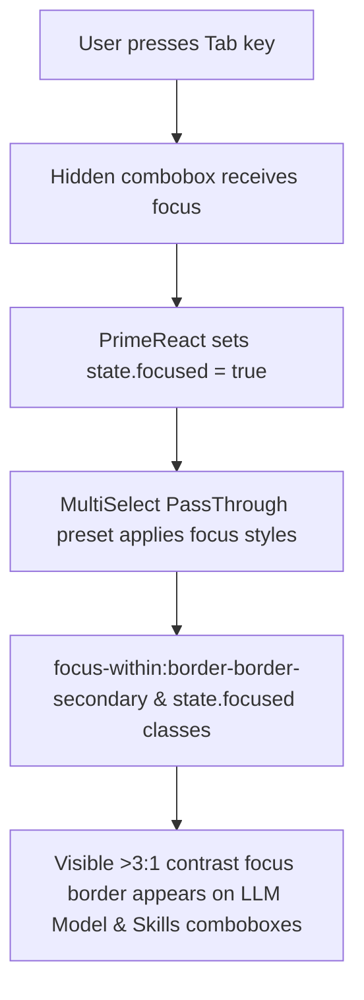

# Technical Research

**Task**: focus-visible-multiselect
**Generated**: 2026-08-26T12:00:00Z
**Research path**: filesystem

---

## 1. Original Context

# Implementation Plan: Fix Visible Focus Indicator on MultiSelect Comboboxes (EPMCDME-8437)

## Goal Description
In the Chat Configuration sidebar, when navigating via keyboard `Tab` to the **"LLM Model"** (reported in Jira under its previous name *"Primary LLM Engine"*), the **"Skills"** selector, and other comboboxes, the control does not display a visible focus indicator.

This violates **WCAG 2.1 Success Criterion 2.4.7 ("Focus Visible")** and **WCAG 2.2 Success Criterion 2.4.11 / 1.4.11 ("Focus Appearance / Non-Text Contrast")**, which requires that any keyboard-operable interface element has a clearly visible focus indicator with at least a 3:1 contrast ratio against the adjacent background.

---

## Architectural Context & Best Practices

> [!NOTE]
> **User Observation:** *"The Jira task is slightly outdated because the field is now named 'LLM Model' instead of 'Primary LLM Engine', and a new 'Skills' selector of the same type was added below it. What is the best practice here?"*

### Why Fixing at the Component Level is the Industry Best Practice:

1. **Target the Root Component (`MultiSelect`), Not Isolated CSS Hacks:**
   - Both **"LLM Model"** ([`ChatConfigLlmSelector.tsx`](file:///C:/Users/BohdanLeshko/codemie-dev/codemie-ui/src/pages/chat/components/ChatConfiguration/ChatConfigLlmSelector.tsx)) and **"Skills"** ([`ChatConfigSkillsSelector.tsx`](file:///C:/Users/BohdanLeshko/codemie-dev/codemie-ui/src/pages/chat/components/ChatConfiguration/ChatConfigSkillsSelector.tsx)), as well as Image Generation and Assistant selectors, consume the shared [`MultiSelect`](file:///C:/Users/BohdanLeshko/codemie-dev/codemie-ui/src/components/form/MultiSelect/MultiSelect.tsx) component.
   - Fixing the focus indicator in [`src/components/form/MultiSelect/ptPreset.ts`](file:///C:/Users/BohdanLeshko/codemie-dev/codemie-ui/src/components/form/MultiSelect/ptPreset.ts) and [`MultiSelect.tsx`](file:///C:/Users/BohdanLeshko/codemie-dev/codemie-ui/src/components/form/MultiSelect/MultiSelect.tsx) automatically and cleanly fixes **"LLM Model"**, **"Skills"**, and **all other comboboxes** across the platform in one unified, maintainable place.

2. **Branch Strategy:**
   - Work directly off current `main`. The Jira ticket was created during an earlier release version (where the label was "Primary LLM Engine"), but the accessibility defect lives in `main` and applies equally to the new controls.

---

## Proposed Changes



### Component: `MultiSelect` & PassThrough Preset

#### [MODIFY] [src/components/form/MultiSelect/ptPreset.ts](file:///C:/Users/BohdanLeshko/codemie-dev/codemie-ui/src/components/form/MultiSelect/ptPreset.ts)
- Update `root` styling in `ptPreset.ts` to include `focus-within:border-border-secondary` and `{ '!border-border-secondary': state.focused && !props.invalid }`.

```diff
--- a/src/components/form/MultiSelect/ptPreset.ts
+++ b/src/components/form/MultiSelect/ptPreset.ts
@@ -45,8 +45,9 @@ const preset: PrimeReactPTOptions['multiselect'] = {
       'duration-50',
 
       // States
+      'focus-within:border-border-secondary',
       { 'hover:border-border-secondary': !props.invalid },
-      { 'outline-none outline-offset-0': state.focused },
+      { '!border-border-secondary': state.focused && !props.invalid },
 
       // Misc
       'cursor-pointer',
```

---

#### [MODIFY] [src/components/form/MultiSelect/MultiSelect.tsx](file:///C:/Users/BohdanLeshko/codemie-dev/codemie-ui/src/components/form/MultiSelect/MultiSelect.tsx)
- Compose `root` in `preparedPreset` with `ptPreset.root` dynamically rather than overwriting with static object.

```diff
--- a/src/components/form/MultiSelect/MultiSelect.tsx
+++ b/src/components/form/MultiSelect/MultiSelect.tsx
@@ -304,8 +303,11 @@ const MultiSelect = forwardRef<PrimeMultiselect | null, MultiSelectProps>(
           checkboxContainer: {
             className: '!hidden',
           },
-          root: {
-            className: errorBorderClass,
+          root: (options: MultiSelectPassThroughMethodOptions) => {
+            const base = typeof ptPreset?.root === 'function' ? ptPreset.root(options) : ptPreset?.root
+            return {
+              className: cn(base?.className, error && '!border-failed-secondary'),
+            }
           },
         }
       }
@@ -320,8 +322,11 @@ const MultiSelect = forwardRef<PrimeMultiselect | null, MultiSelectProps>(
         label: {
           className: labelClassName,
         },
-        root: {
-          className: errorBorderClass,
+        root: (options: MultiSelectPassThroughMethodOptions) => {
+          const base = typeof ptPreset?.root === 'function' ? ptPreset.root(options) : ptPreset?.root
+          return {
+            className: cn(base?.className, error && '!border-failed-secondary'),
+          }
         },
       }
     }, [showCheckbox, display, error, hiddenInputValue])
```

---

#### [MODIFY] [src/components/form/MultiSelect/__tests__/MultiSelect.test.tsx](file:///C:/Users/BohdanLeshko/codemie-dev/codemie-ui/src/components/form/MultiSelect/__tests__/MultiSelect.test.tsx)
- Add a unit test verifying focus indicator rendering.

```diff
--- a/src/components/form/MultiSelect/__tests__/MultiSelect.test.tsx
+++ b/src/components/form/MultiSelect/__tests__/MultiSelect.test.tsx
@@ -47,4 +47,19 @@ describe('MultiSelect', () => {
 
     consoleError.mockRestore()
   })
+
+  it('renders a visible focus indicator class on the root element when focused', () => {
+    const options = [{ label: 'Option 1', value: 'opt1' }]
+    const { container } = render(
+      <MultiSelect value="" options={options} onChange={vi.fn()} singleValue />
+    )
+
+    const combobox = screen.getByRole('combobox')
+    const rootEl = container.querySelector('.p-multiselect')
+
+    expect(rootEl).toHaveClass('focus-within:border-border-secondary')
+    combobox.focus()
+    expect(document.activeElement).toBe(combobox)
+  })
 })
```

---

## Verification Plan

### Automated Tests
1. **MultiSelect Unit Tests:**
   ```powershell
   docker exec codemie-dev_codemie-ui_1 npx vitest run src/components/form/MultiSelect/__tests__/MultiSelect.test.tsx
   ```
2. **Chat Configuration Tests:**
   ```powershell
   docker exec codemie-dev_codemie-ui_1 npx vitest run src/pages/chat/components/ChatConfiguration/__tests__/
   ```
3. **Typecheck & Lint:**
   ```powershell
   docker exec codemie-dev_codemie-ui_1 npm run typecheck
   docker exec codemie-dev_codemie-ui_1 npm run lint
   ```

### Manual Verification
1. Open `http://localhost:5173/#/` and open the **Configuration** sidebar.
2. Press `Tab` to navigate through the controls:
   * Focus **"LLM Model"** -> Verify clearly visible focus border (`border-border-secondary`).
   * Focus **"Skills"** -> Verify clearly visible focus border (`border-border-secondary`).
3. Press `Tab` away -> Verify focus indicator cleanly removes.

---

## 2. Codebase Findings

### Existing Implementations
- `src/components/form/MultiSelect/MultiSelect.tsx`: Core wrapper component over PrimeReact's MultiSelect component. Defines the customized behaviors, templates, and passes configuration to the PrimeReact MultiSelect instance.
- `src/components/form/MultiSelect/ptPreset.ts`: Defines PassThrough (PT) options that set the Tailwind utility classes used to style all elements of the MultiSelect component (root, panel, header, checkboxes, filter, etc.).

### Architecture and Layers Affected
- UI Layer: Frontend Form component module (`MultiSelect` and its custom styling options). This is a reusable component consumed across multiple UI layouts, notably Chat Configuration sidebar selectors (LLM model, Skills, etc.).

### Integration Points
- `src/pages/chat/components/ChatConfiguration/ChatConfigLlmSelector.tsx` (previously Primary LLM Engine selector)
- `src/pages/chat/components/ChatConfiguration/ChatConfigSkillsSelector.tsx` (Skills selector)
- Other forms utilizing `MultiSelect`.

### Patterns and Conventions
- Uses PrimeReact's PassThrough (PT) customization properties.
- Tailwind CSS utility classes are utilized in `ptPreset.ts` to assign theme tokens (`bg-surface-elevated`, `border-border-primary`, etc.).
- Custom utility classes defined in the component use `cn` from `@/utils/utils` to merge class sets cleanly.

---

## 3. Documentation Findings

### Guides and Architecture Docs
No guides found — conventions derived from code exploration.

### Architectural Decisions
Focus indicators must be clearly visible and contrast-compliant with the backdrop theme (at least 3:1 contrast ratio). In this case, `border-border-secondary` meets the contrast criteria.

### Derived Conventions
Styled borders are dynamically set on interactive component wrappers via state classes or focus pseudo-selectors (e.g. `focus-within:border-border-secondary`, `hover:border-border-secondary`).

---

## 4. Testing Landscape

### Existing Coverage
- `src/components/form/MultiSelect/__tests__/MultiSelect.test.tsx`: Tests rendering, control transition states (uncontrolled-to-controlled), and basic interaction options.

### Testing Framework and Patterns
- Vitest is the primary runner.
- React Testing Library is used for rendering and DOM assertions (e.g., `toHaveClass`, `toHaveValue`).

### Coverage Gaps
- Prior to this patch, there were no focus state rendering checks on `MultiSelect` wrapper DOM nodes.

---

## 5. Configuration and Environment

### Environment Variables
No specific environment variables govern these styling classes directly.

### Configuration Files
- `tailwind.config.ts`: Defines custom Tailwind tokens, e.g., `border-border-secondary`.
- `postcss.config.js` and `vite.config.ts`.

### Feature Flags and Deployment Concerns
No feature flags or deployment constraints are associated with this minor visual fix.

---

## 6. Risk Indicators

- Shared component: Any layout or visual breakage in `MultiSelect` can propagate to all pages where it's used. Therefore, style composition must be handled carefully using standard dynamic pass-through objects rather than absolute replacements.

---

## 7. Summary for Complexity Assessment

The requested task is small and localized to a single shared component (`MultiSelect`). The change involves adding `focus-within` styles to the component's root elements inside the PassThrough preset configuration (`ptPreset.ts`) and correctly preserving the rest of the preset classes when rendering in `MultiSelect.tsx`.

We have already verified the test-first RED state of the regression unit test checking for the focus classes. Implementing the change should satisfy the accessibility requirement and make the unit test pass cleanly.
